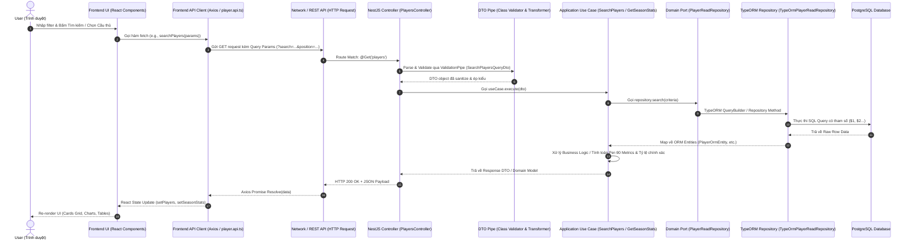

# KIẾN TRÚC LUỒNG DỮ LIỆU TỪ FRONTEND XUỐNG DATABASE & CƠ CHẾ QUERY TRONG SCOUTBOARD

Tài liệu này giải thích chi tiết toàn bộ chu trình xử lý dữ liệu trong hệ thống **ScoutBoard**: Từ khi người dùng tương tác trên giao diện React (Frontend), gọi HTTP Request qua REST API, đi qua các tầng của NestJS (Clean Architecture / Hexagonal Architecture), sinh câu lệnh SQL thông qua TypeORM và truy vấn trong cơ sở dữ liệu PostgreSQL.

---

## 1. SƠ ĐỒ TỔNG QUAN LUỒNG TRUYỀN DỮ LIỆU (END-TO-END FLOW)



---

## 2. PHÂN TÍCH CHI TIẾT TỪNG TẦNG TRONG HỆ THỐNG

### TẦNG 1: FRONTEND (UI & API CLIENT)

#### 1.1. Giao diện người dùng (React Component)
- **Vị trí**: `frontend/src/pages/PlayerSearchPage.tsx`, `frontend/src/pages/PlayerDetailPage.tsx`
- **Nhiệm vụ**:
  - Lưu trữ trạng thái bộ lọc trong React State (`useState`, `useSearchParams`).
  - Lắng nghe sự kiện click/change và kích hoạt hàm tải dữ liệu (`useEffect` hoặc Handler).

```typescript
// Trích đoạn frontend/src/pages/PlayerDetailPage.tsx
useEffect(() => {
  if (!playerId) return;

  setStatsLoading(true);
  getPlayerSeasonStatisticsApi(playerId)
    .then((data) => {
      setSeasonStats(data);
      // Auto chọn mùa giải & giải đấu mặc định
    })
    .catch((err) => setStatsError(err.message))
    .finally(() => setStatsLoading(false));
}, [playerId]);
```

#### 1.2. API Service Client (Axios)
- **Vị trí**: `frontend/src/api/player.api.ts`, `frontend/src/api/client.ts`
- **Nhiệm vụ**:
  - Đóng gói URL endpoint và các tham số query param.
  - Tự động gắn header `Authorization: Bearer <token>` nếu người dùng đã đăng nhập.
  - Chuyển đổi HTTP Response thành TypeScript Interface chuẩn.

```typescript
// Trích đoạn frontend/src/api/player.api.ts
export const getPlayerSeasonStatisticsApi = async (
  playerId: string,
): Promise<PlayerSeasonStatisticItem[]> => {
  const res = await apiClient.get<PlayerSeasonStatisticItem[]>(
    `/players/${playerId}/season-statistics`,
  );
  return res.data;
};
```

---

### TẦNG 2: PRESENTATION & TRANSPORT (NESTJS CONTROLLER & DTO)

#### 2.1. Routing & Controller Layer
- **Vị trí**: `backend/src/modules/players/presentation/http/controllers/players.controller.ts`
- **Nhiệm vụ**:
  - Nhận HTTP Request từ client (`@Get`, `@Post`, `@Patch`...).
  - Định tuyến vào Use Case tương ứng.
  - Không chứa logic nghiệp vụ nặng hoặc câu lệnh database trực tiếp.

```typescript
// Trích đoạn players.controller.ts
@Get(':id/season-statistics')
@ApiOperation({ summary: 'Lấy danh sách thống kê theo mùa giải của cầu thủ' })
async getSeasonStatistics(
  @Param('id', ParseUUIDPipe) id: string,
): Promise<PlayerSeasonStatisticResponseDto[]> {
  return this.getSeasonStatisticsUseCase.execute(id);
}
```

#### 2.2. DTO Validation & Transformation Layer
- **Vị trí**: `backend/src/modules/players/presentation/http/dto/search-players-query.dto.ts`
- **Nhiệm vụ**:
  - **White-listing**: Tự động loại bỏ các thuộc tính rác không được khai báo (`whitelist: true`, `forbidNonWhitelisted: true`).
  - **Type Casting**: Ép kiểu chuỗi từ query string (`"20"`) thành số thực (`20`) bằng `class-transformer` (`@Type(() => Number)`).
  - **Validation**: Kiểm tra điều kiện giới hạn (`@Min(0)`, `@Max(100)`, `@IsUUID()`, `@IsEnum()`).

```typescript
// Trích đoạn search-players-query.dto.ts
export class SearchPlayersQueryDto {
  @ApiPropertyOptional({ description: 'Từ khóa tìm kiếm theo tên' })
  @IsOptional()
  @IsString()
  @Transform(({ value }) => (typeof value === 'string' && value.trim() ? value.trim() : undefined))
  search?: string;

  @ApiPropertyOptional({ description: 'Vị trí thi đấu (GK, CB, CM, ST...)' })
  @IsOptional()
  @IsString()
  position?: string;

  @ApiPropertyOptional({ default: 20 })
  @IsOptional()
  @Type(() => Number)
  @IsInt()
  @Min(1)
  @Max(100)
  limit: number = 20;

  @ApiPropertyOptional({ default: 0 })
  @IsOptional()
  @Type(() => Number)
  @IsInt()
  @Min(0)
  offset: number = 0;
}
```

---

### TẦNG 3: APPLICATION & DOMAIN (USE CASES & BUSINESS LOGIC)

- **Vị trí**: 
  - `backend/src/modules/players/application/use-cases/search-players.use-case.ts`
  - `backend/src/modules/players/application/use-cases/get-player-season-statistics.use-case.ts`
  - `backend/src/modules/players/application/use-cases/get-player-match-statistics.use-case.ts`
- **Nhiệm vụ**:
  - Điều phối luồng nghiệp vụ chính.
  - Tương tác với Database thông qua Interface Port (`PlayerReadRepository`), tuân thủ nguyên lý Dependency Inversion (DIP).
  - **Thực hiện các phép tính Derived Per-90 Metrics & Pass Accuracy**:

```typescript
// Trích đoạn get-player-season-statistics.use-case.ts
// 1. Lấy dữ liệu thống kê của cầu thủ
const records = await this.playerRepository.findSeasonStatisticsByPlayerId(playerId);

// 2. Với mỗi mùa giải, tính toán các chỉ số phái sinh Per-90 và Tỷ lệ chính xác
for (const stat of records) {
  const minutes = stat.minutesPlayed || 0;
  const goalsP90 = calculatePer90(stat.goals, minutes);
  const assistsP90 = calculatePer90(stat.assists, minutes);
  const passAcc = calculatePassAccuracy(stat.passesCompleted, stat.passesAttempted);
  
  if (player.primaryPosition === 'GK') {
    const savesP90 = calculatePer90(stat.saves, minutes);
    const goalsConcededP90 = calculatePer90(stat.goalsConceded, minutes);
  }
}
```

---

### TẦNG 4: PERSISTENCE & DATABASE QUERY (TYPEORM & POSTGRESQL)

- **Vị trí**: `backend/src/modules/players/infrastructure/persistence/typeorm/repositories/typeorm-player-read.repository.ts`

#### 4.1. Cách Query Tìm kiếm Cầu thủ với Dynamic Filter & Pagination
Trong `TypeOrmPlayerReadRepository.search()`, hệ thống sử dụng **TypeORM QueryBuilder** để xây dựng câu lệnh SQL linh hoạt và an toàn:

```typescript
// Trích đoạn typeorm-player-read.repository.ts
async search(query: SearchPlayersQuery): Promise<{ items: PlayerOrmEntity[]; total: number }> {
  const qb = this.repository
    .createQueryBuilder('player')
    .leftJoinAndSelect('player.currentTeam', 'currentTeam')
    .leftJoinAndSelect('player.positions', 'positions');

  // 1. Lọc theo từ khóa tên cầu thủ (Case-insensitive ILIKE)
  if (query.search) {
    qb.andWhere(
      '(player.name ILIKE :search OR player.shortName ILIKE :search)',
      { search: `%${query.search}%` },
    );
  }

  // 2. Lọc theo vị trí (Hỗ trợ cả primaryPosition và mảng secondary positions)
  if (query.position) {
    qb.innerJoin('player.positions', 'posFilter').andWhere(
      '(player.primaryPosition = :posCode OR posFilter.positionCode = :posCode)',
      { posCode: query.position },
    );
  }

  // 3. Phân trang & Sắp xếp
  qb.orderBy('player.name', 'ASC')
    .addOrderBy('player.id', 'ASC')
    .take(query.limit)
    .skip(query.offset);

  // 4. Thực thi truy vấn lấy cả dữ liệu lẫn tổng số dòng (Total Count)
  const [items, total] = await qb.getManyAndCount();
  return { items, total };
}
```

---

## 3. CÂU LỆNH SQL THỰC TẾ ĐƯỢC SINH RA DƯỚI DATABASE

Khi Frontend gửi request `GET /api/players?search=Raya&position=GK&limit=20&offset=0`, TypeORM tự động sinh và gửi xuống PostgreSQL câu lệnh SQL sau:

```sql
SELECT 
    "player"."id" AS "player_id",
    "player"."name" AS "player_name",
    "player"."short_name" AS "player_short_name",
    "player"."date_of_birth" AS "player_date_of_birth",
    "player"."nationality" AS "player_nationality",
    "player"."height_cm" AS "player_height_cm",
    "player"."weight_kg" AS "player_weight_kg",
    "player"."preferred_foot" AS "player_preferred_foot",
    "player"."primary_position" AS "player_primary_position",
    "player"."shirt_number" AS "player_shirt_number",
    "currentTeam"."id" AS "currentTeam_id",
    "currentTeam"."name" AS "currentTeam_name",
    "currentTeam"."short_name" AS "currentTeam_short_name",
    "currentTeam"."logo_url" AS "currentTeam_logo_url",
    "positions"."id" AS "positions_id",
    "positions"."position_code" AS "positions_position_code"
FROM "players" "player"
LEFT JOIN "teams" "currentTeam" 
    ON "currentTeam"."id" = "player"."current_team_id"
LEFT JOIN "player_positions" "positions" 
    ON "positions"."player_id" = "player"."id"
INNER JOIN "player_positions" "posFilter" 
    ON "posFilter"."player_id" = "player"."id"
WHERE 
    ("player"."name" ILIKE $1 OR "player"."short_name" ILIKE $1)
    AND ("player"."primary_position" = $2 OR "posFilter"."position_code" = $2)
ORDER BY "player"."name" ASC, "player"."id" ASC
LIMIT 20 OFFSET 0;
-- Parameters: $1 = '%Raya%', $2 = 'GK'
```

---

## 4. BẢNG TỔNG HỢP MAPPING DỮ LIỆU TỪ FE ĐẾN DB

| Thông tin nghiệp vụ | Frontend State / DTO Key | Backend Entity Field | Kiểu dữ liệu SQL | Bảng Database |
|---|---|---|---|---|
| **ID Cầu thủ** | `playerId` | `player.id` | `UUID (PRIMARY KEY)` | `players` |
| **Vị trí chính** | `primaryPosition` | `player.primaryPosition` | `VARCHAR(10)` | `players` |
| **Số áo** | `shirtNumber` | `player.shirtNumber` | `INTEGER (NULLABLE)` | `players` |
| **Số phút thi đấu** | `minutesPlayed` | `minutesPlayed` | `INTEGER` | `player_season_statistics` |
| **Cứu thua (Saves)** | `saves` | `saves` | `INTEGER (NULLABLE)` | `player_season_statistics` |
| **Bàn thua (Goals Conceded)** | `goalsConceded` | `goalsConceded` | `INTEGER (NULLABLE)` | `player_season_statistics` |
| **Giữ sạch lưới** | `cleanSheets` | `cleanSheets` | `INTEGER (NULLABLE)` | `player_season_statistics` |
| **% Cứu thua (Raw)** | `savePercentage` | `savePercentage` | `DECIMAL(5,2)` | `player_season_statistics` |
| **Cứu thua/90p (Derived)** | `savesPer90` | `savesPer90` | `DECIMAL(5,2)` | `player_season_statistics` |
| **Trận đấu & Tỉ số** | `match.homeScore`, `awayScore` | `match.homeScore` | `INTEGER` | `matches` |
| **Cứu thua theo trận** | `item.saves` | `saves` | `INTEGER (NULLABLE)` | `player_match_statistics` |

---

## 5. CÁC NGUYÊN TẮC QUAN TRỌNG TRONG XÂY DỰNG QUERY

1. **Bảo mật phòng chống SQL Injection**:
   - Luôn sử dụng Parameterized Query của TypeORM (`:search`, `:posCode`) với biến thay thế `$1, $2`. Tuyệt đối không nối chuỗi thô (`'WHERE name = ' + name`).
2. **Deterministic Sorting (Sắp xếp ổn định khi phân trang)**:
   - Khi dùng `LIMIT` và `OFFSET`, luôn luôn có cột thứ hai làm tie-breaker (e.g. `ORDER BY player.name ASC, player.id ASC`) để tránh trùng hoặc nhảy trang dữ liệu.
3. **Lazy vs Eager Relations**:
   - Dùng `leftJoinAndSelect` hoặc `relations: ['season', 'competition', 'team']` một cách có chủ đích nhằm giải quyết bài toán $N+1$ query.
4. **Tách bạch tính toán (Separation of Concerns)**:
   - **Database**: Lưu trữ dữ liệu thô (Raw metrics) chính xác và nhanh nhất.
   - **Backend Application Layer**: Đảm nhiệm tính toán các chỉ số phái sinh (Per-90, Tỷ lệ chính xác %).
   - **Frontend UI**: Đảm nhiệm trình diễn trực quan (Gradients, Badges, Charts, Adaptation theo vị trí GK / Outfield).
