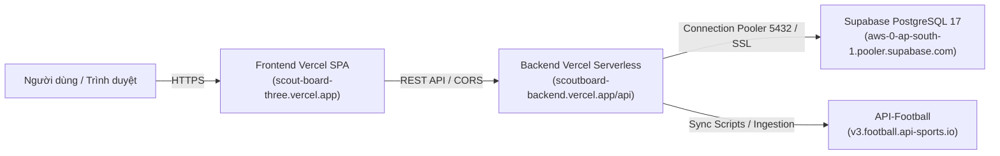

# 📋 TÀI LIỆU BÀN GIAO DỰ ÁN SCOUTBOARD (PROJECT HANDOVER DOCUMENT)

> **Dự án**: ScoutBoard — Nền tảng Tìm kiếm, So sánh chỉ số và Xây dựng Đội hình Cầu thủ Bóng đá  
> **Chủ sở hữu**: Lê Hoàng Nhật Anh (`anh367641@gmail.com` / GitHub: `NhatAnh03082005`)  
> **Thời gian cập nhật**: Tháng 9/2026  
> **Kho mã nguồn**: [https://github.com/NhatAnh03082005/ScoutBoard.git](https://github.com/NhatAnh03082005/ScoutBoard.git)

---

## 1. TỔNG QUAN KIẾN TRÚC HỆ THỐNG

ScoutBoard được xây dựng theo mô hình Monorepo:
* **Frontend (`/frontend`)**: React 18, Vite, TypeScript, Vitest, Vanilla CSS / Component-scoped styling. Triển khai trên **Vercel** (Edge CDN).
* **Backend (`/backend`)**: NestJS 11, TypeScript, TypeORM, PostgreSQL, Passport JWT Auth, Throttler, Swagger Docs (`/api/docs`). Triển khai theo mô hình **Vercel Serverless Function** (`/api/index.ts`).
* **Database**: PostgreSQL 17 (chạy Docker ở local, chạy Supabase Connection Pooler IPv4 trên production).
* **Nhà cung cấp dữ liệu bóng đá**: API-Football (`api-sports.io`).

Mermaid sơ đồ kiến trúc triển khai Production:


---

## 2. LINK TRIỂN KHAI PRODUCTION (DEPLOYMENT URLS)

| Thành phần | Nền tảng | Link trực tiếp | Trạng thái | Ghi chú |
| :--- | :--- | :--- | :--- | :--- |
| **Frontend Web** | **Vercel** | [https://scout-board-three.vercel.app](https://scout-board-three.vercel.app) | 🟢 LIVE | Web SPA chính thức, tự động deploy từ nhánh `main` |
| **Backend API** | **Vercel** | [https://scoutboard-backend.vercel.app/api](https://scoutboard-backend.vercel.app/api) | 🟢 LIVE | Serverless API (Production Domain vĩnh viễn) |
| **Swagger API Docs** | **Vercel** | [https://scoutboard-backend.vercel.app/api/docs](https://scoutboard-backend.vercel.app/api/docs) | 🟢 LIVE | Tài liệu đặc tả RESTful APIs + Bearer Auth JWT |
| **Trang chủ Backend** | **Vercel** | [https://scoutboard-backend.vercel.app](https://scoutboard-backend.vercel.app) | 🟢 LIVE | Tự động Redirect 302 sang `/api/docs` |
| **Backend (Cũ)** | **Render** | [https://scoutboard-backend.onrender.com](https://scoutboard-backend.onrender.com) | 🟡 Dự phòng | Service cũ trên Render (có thể pause để tiết kiệm) |
| **Database Cloud** | **Supabase** | `aws-0-ap-south-1.pooler.supabase.com:5432` | 🟢 LIVE | 3.017 cầu thủ, 606 CLB, 21 TypeORM migrations |
| **Source Code** | **GitHub** | [https://github.com/NhatAnh03082005/ScoutBoard](https://github.com/NhatAnh03082005/ScoutBoard) | 🟢 LIVE | Nhánh chính: `main`, nhánh phát triển: `dev` |

---

## 3. THÔNG TIN CẤU HÌNH & TÀI KHOẢN CLOUD

### 3.1. Backend Hosting trên Vercel (Chi tiết triển khai)

* **Nền tảng**: [https://vercel.com](https://vercel.com) (Tài khoản: `NhatAnh03082005` / `anh367641@gmail.com`)
* **Project Name**: `scoutboard-backend`
* **Root Directory**: `backend` (⚠️ Bắt buộc chọn thư mục con `backend`)
* **Framework Preset**: `Other`
* **Build Command**: `npm run build` (Chạy `nest build` tạo mã JS tối ưu vào thư mục `dist/`)
* **Output Directory**: Để trống mặc định
* **Production Domain**: `scoutboard-backend.vercel.app`
* **Preview Domain**: `scoutboard-backend-git-main-nhat-anh.vercel.app`

#### Cấu trúc file cấu hình Serverless Backend:
1. **`backend/vercel.json`**:
   * Cấu hình `functions.includeFiles`: `"dist/**"` để Vercel đóng gói toàn bộ mã nguồn đã biên dịch của NestJS vào gói Serverless function.
   * Cấu hình `headers`: Bổ sung header CORS (`Access-Control-Allow-Origin: https://scout-board-three.vercel.app`, `Credentials: true`, `Methods: GET,POST,PUT,PATCH,DELETE,OPTIONS`) tại tầng Edge Network.
   * Cấu hình `rewrites`: Điều hướng mọi request `/(.*)` vào Serverless handler `/api`.
2. **`backend/api/index.ts`**:
   * Khởi tạo Express Adapter kết nối NestJS `AppModule` từ `dist/src/app.module`.
   * Tự động giải quyết đường dẫn alias (`src/...` ➔ `dist/src/...`) qua module resolver.
   * Xử lý tức thì preflight `OPTIONS` trả về `204 No Content` trong 5ms mà không cần chờ khởi động NestJS.
   * Tự động Redirect 302 các truy cập vào `/` hoặc `/api` sang Swagger UI `/api/docs`.
   * Bọc `bootstrap()` và `server(req, res)` bằng `res.on('finish')` để giữ Serverless function hoạt động đồng bộ, tránh lỗi `FUNCTION_INVOCATION_FAILED`.
3. **`backend/src/app.module.ts`**:
   * Cấu hình `autoLoadEntities: true` và `entities: []` trong `TypeOrmModule.forRoot` để tải thực thể theo `forFeature` thay vì quét file glob trên hệ điều hành ảo serverless.

#### Danh sách Biến môi trường (Environment Variables) trên Vercel Backend:
> Áp dụng cho cả 3 môi trường: **Production**, **Preview**, **Development**.

| Key (Tên biến) | Value (Giá trị mẫu/thực tế) | Mục đích / Ghi chú |
| :--- | :--- | :--- |
| `NODE_ENV` | `production` | Chế độ chạy production |
| `POSTGRES_HOST` | `aws-0-ap-south-1.pooler.supabase.com` | Host kết nối Supabase Pooler IPv4 |
| `POSTGRES_PORT` | `5432` | Cổng Session Pooler (hoặc `6543` Transaction) |
| `POSTGRES_DB` | `postgres` | Tên cơ sở dữ liệu Supabase |
| `POSTGRES_USER` | `postgres.utpuxqpokpqnxpqqiens` | Username dạng `<user>.<project-ref>` |
| `POSTGRES_PASSWORD` | `03082005Anhle@@` | Mật khẩu database Supabase |
| `POSTGRES_SSL` | `true` | Bắt buộc bật SSL |
| `JWT_SECRET` | `scoutboard_jwt_access_secret_production_2026_super_key` | Secret key ký Access Token (≥ 32 ký tự) |
| `JWT_REFRESH_SECRET` | `scoutboard_jwt_refresh_secret_production_2026_super_key` | Secret key ký Refresh Token (≥ 32 ký tự) |
| `JWT_EXPIRES_IN` | `15m` | Thời hạn sống của Access Token |
| `JWT_REFRESH_EXPIRES_IN` | `7d` | Thời hạn sống của Refresh Token |
| `FRONTEND_ORIGIN` | `https://scout-board-three.vercel.app` | Domain Frontend được phép gọi API (CORS) |
| `API_FOOTBALL_KEY` | `09b395257421d95a43fa4fd945df43b7` | API key lấy dữ liệu cầu thủ từ api-sports.io |
| `API_FOOTBALL_BASE_URL`| `https://v3.football.api-sports.io` | URL gốc của API Football |
| `THROTTLE_GLOBAL_TTL_MS`| `60000` | Cửa sổ giới hạn tốc độ (1 phút) |
| `THROTTLE_GLOBAL_LIMIT` | `100` | Giới hạn 100 requests / phút / IP |

---

### 3.2. Frontend Hosting trên Vercel

* **Nền tảng**: [https://vercel.com](https://vercel.com)
* **Project Name**: `scout-board`
* **Root Directory**: `frontend`
* **Framework**: `Vite`
* **Build Command**: `npm run build`
* **Output Directory**: `dist`
* **Domain Production**: [https://scout-board-three.vercel.app](https://scout-board-three.vercel.app)
* **Environment Variables trên Vercel (Frontend)**:

| Key (Tên biến) | Value (Giá trị) | Ghi chú |
| :--- | :--- | :--- |
| `VITE_API_BASE_URL` | `https://scoutboard-backend.vercel.app/api` | Bắt buộc có `https://` và kết thúc bằng `/api` |

---

### 3.3. Database Cloud (Supabase)

* **Nền tảng**: [https://supabase.com](https://supabase.com) (Đăng nhập qua GitHub `NhatAnh03082005`)
* **Project Name**: `scoutboard-db`
* **Project Ref**: `utpuxqpokpqnxpqqiens`
* **Region**: Asia-Pacific (Mumbai / `ap-south-1`)
* **Thông số kết nối IPv4 (Connection Pooler)**:
  * **Host**: `aws-0-ap-south-1.pooler.supabase.com`
  * **Port**: `5432` (Session Mode)
  * **User**: `postgres.utpuxqpokpqnxpqqiens`
  * **Password**: `03082005Anhle@@`
  * **Database Name**: `postgres`
  * **SSL**: `true` (`{ rejectUnauthorized: false }`)
* **Trạng thái dữ liệu**: 21 migrations đồng bộ 100% với local, 3.017 cầu thủ, 606 CLB, 5 giải đấu, 1.756 trận đấu, 21.580 thống kê trận đấu.

---

### 3.4. Dịch vụ API Bóng Đá (API-Football)

* **Website**: [https://dashboard.api-football.com/](https://dashboard.api-football.com/)
* **Tài khoản**: `anh367641@gmail.com`
* **Gói cước**: Free (100 requests / ngày, reset vào 00:00 UTC = 07:00 sáng VN)
* **API Key**: `09b395257421d95a43fa4fd945df43b7`
* **Base URL**: `https://v3.football.api-sports.io`

---

## 4. QUY TRÌNH CHẠY LOCAL (DEVELOPMENT)

### 4.1. Khởi động Database Local (Docker):
```powershell
docker start scoutboard-postgres
# Hoặc docker-compose up -d postgres
```

### 4.2. Chạy Backend Local:
```powershell
cd d:\FullStack\Football\ScoutBoard\backend
npm install
npm run start:dev
# API Endpoint: http://localhost:3000/api
# Swagger Docs: http://localhost:3000/api/docs
```

### 4.3. Chạy Frontend Local:
```powershell
cd d:\FullStack\Football\ScoutBoard\frontend
npm install
npm run dev
# Web Local: http://localhost:5173
```

---

## 5. HƯỚNG DẪN BẢO TRÌ & XỬ LÝ SỰ CỐ (TROUBLESHOOTING)

### 5.1. Khi sửa biến môi trường trên Vercel Backend
* **Quy tắc**: Vercel **KHÔNG** tự động cập nhật biến môi trường vào bản deploy đang chạy.
* **Cách áp dụng**: Sau khi thêm hoặc sửa biến trong **Settings ➔ Environment Variables**, phải vào tab **Deployments** ➔ bấm dấu **`...`** ➔ chọn **Redeploy** (hoặc `git push` một commit mới lên nhánh `main`).

### 5.2. Nhận biết trạng thái Deploy trên Vercel Dashboard
* **`Ready` (Màu xanh lá)**: Bản deploy mới nhất, đang phục vụ lưu lượng truy cập trực tiếp.
* **`Ready Stale`**: Bản deploy cũ đã được thay thế bởi bản mới hơn. Hình ảnh thumbnail của bản cũ là ảnh chụp tĩnh lịch sử, không ảnh hưởng đến bản hiện tại.

### 5.3. Các lệnh kiểm tra sức khỏe Backend (Live Health Check)
Có thể chạy các lệnh PowerShell sau để kiểm tra Backend Vercel bất kỳ lúc nào:
```powershell
# 1. Kiểm tra trạng thái máy chủ
curl.exe -i "https://scoutboard-backend.vercel.app/api/health"

# 2. Kiểm tra danh sách vị trí cầu thủ
curl.exe -i "https://scoutboard-backend.vercel.app/api/players/positions"

# 3. Kiểm tra truy vấn Database cầu thủ
curl.exe -i "https://scoutboard-backend.vercel.app/api/players?limit=5&offset=0"

# 4. Kiểm tra tài liệu Swagger
curl.exe -i "https://scoutboard-backend.vercel.app/api/docs"
```
