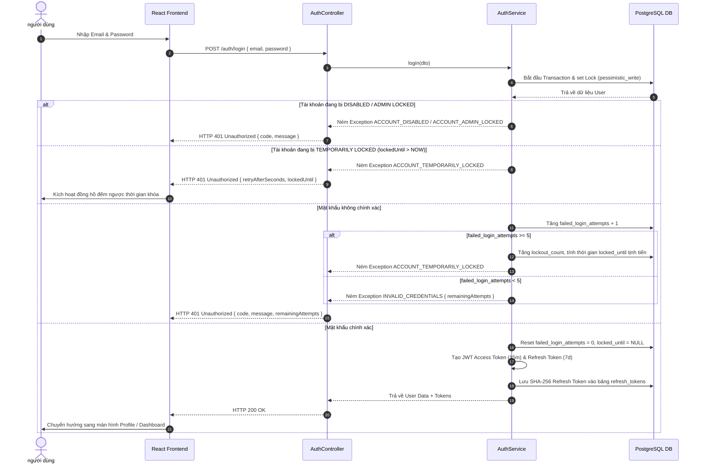
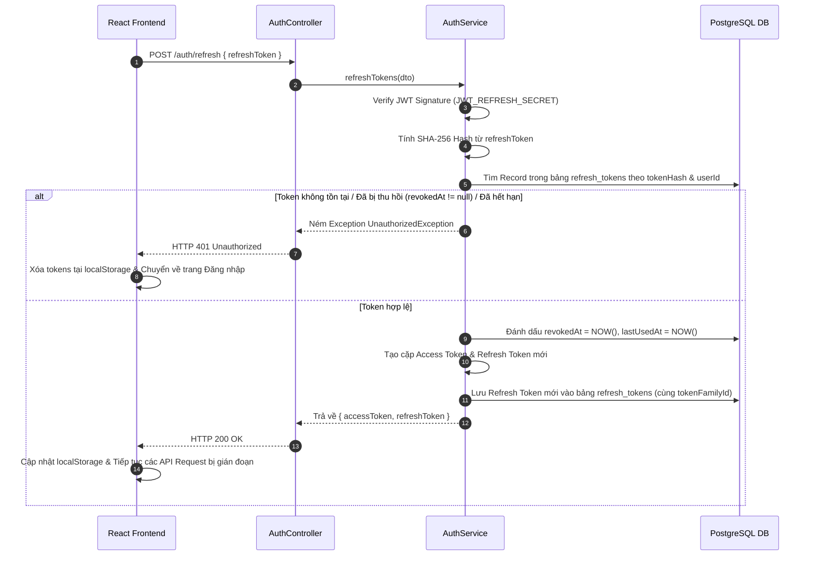
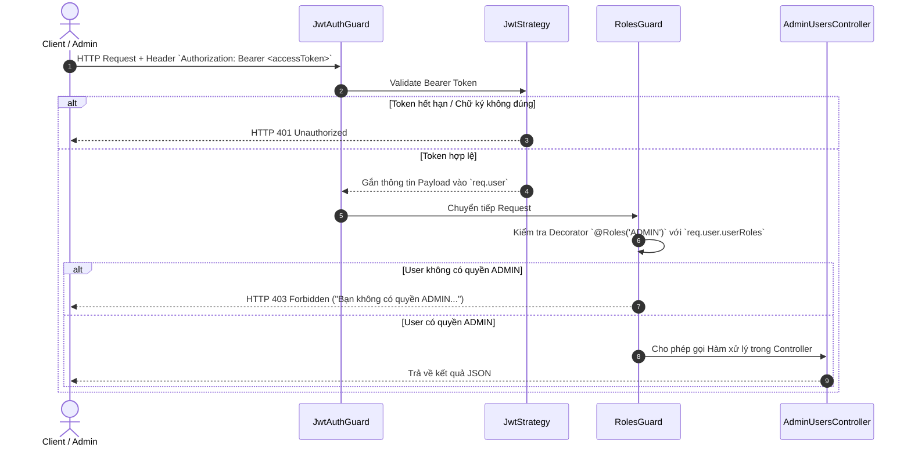
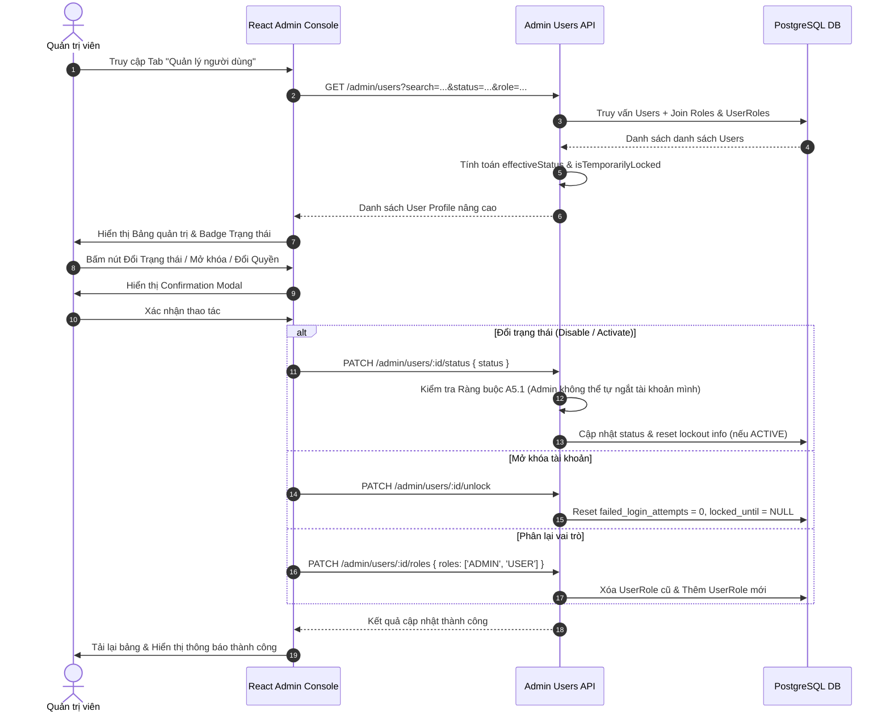

# ScoutBoard ⚽
> **Football Player Search, Comparison and Squad Building Platform**

**ScoutBoard** là một nền tảng Web Full-Stack hỗ trợ quản lý tài khoản, tìm kiếm, phân tích, so sánh cầu thủ và xây dựng đội hình bóng đá. Dự án được thiết kế và phát triển theo các chuẩn mực của **Software Engineering**, tối ưu hiệu năng cơ sở dữ liệu và bảo mật hệ thống cao cấp.

---

## 🎯 1. Tổng Quan Dự Án & Bài Toán Cần Giải Quyết

### **1.1. Bài toán thực tế**
Người hâm mộ bóng đá và chuyên viên phân tích thường cần:
- Tìm kiếm cầu thủ theo nhiều tiêu chí nâng cao (chỉ số chuẩn hóa theo 90 phút).
- So sánh các cầu thủ cùng vị trí hoặc khác câu lạc bộ trong mùa giải.
- Lưu trữ danh sách theo dõi cá nhân (Shortlists).
- Xây dựng sơ đồ đội hình bóng đá mong muốn (Squad Builder) với các quy tắc vị trí thi đấu.
- Đồng bộ dữ liệu thường xuyên từ nguồn dữ liệu bên ngoài (External Football API).

### **1.2. Phân quyền người dùng (Role-Based Access Control - RBAC)**
- **GUEST:** Khách chưa đăng nhập có thể tìm kiếm, xem chi tiết và so sánh cầu thủ.
- **USER:** Người dùng đã đăng nhập có toàn bộ quyền của GUEST + Quản lý Shortlist cá nhân & Xây dựng Đội hình (Squad Builder).
- **ADMIN:** Quản trị viên có toàn bộ quyền của USER + Bảng Quản trị Người dùng (Admin Console), lên lịch, vận hành và quản lý lỗi đồng bộ dữ liệu.

---

## 🛠 2. Các Công Nghệ Sử Dụng (Technology Stack)

### **Backend (API Service)**
- **Core Framework:** [NestJS 11](https://nestjs.com/) (Node.js framework xây dựng ứng dụng phía Server có cấu trúc Modular Monolith).
- **Ngôn ngữ:** TypeScript 5.
- **Platform Web:** Express Engine.
- **Database & ORM:** PostgreSQL 17 + [TypeORM 0.3](https://typeorm.io/) (Quản lý Schema, Migrations, Seeding, Transactions & Pessimistic Locks).
- **Authentication & Security:**
  - JWT (`@nestjs/jwt`, `@nestjs/passport`, `passport-jwt`): Cấp phát Access Token & Refresh Token.
  - `bcryptjs`: Mã hóa mật khẩu an toàn với Salt (10 rounds).
  - `crypto` (Node.js Native): Băm SHA-256 cho Refresh Token Hash.
  - **Progressive Account Lockout:** Cơ chế tự động khóa tài khoản tịnh tiến theo bậc để chống tấn công Brute-Force.
- **Validation & Transformation:** `class-validator` & `class-transformer` kết hợp NestJS Global `ValidationPipe`.
- **API Documentation:** OpenAPI 3.0 / [Swagger](https://swagger.io/) (`@nestjs/swagger`).

### **Frontend (Client Web App)**
- **Core Library:** [React 19](https://react.dev/) (Single Page Application - SPA).
- **Ngôn ngữ:** TypeScript 6.
- **Build Tool / Bundler:** [Vite 8](https://vitejs.dev/) (Tối ưu tốc độ HMR và Build sản phẩm).
- **Styling:** Vanilla CSS3 + Custom CSS Tokens (Thiết kế giao diện Dark Mode hiện đại, hiệu ứng Glassmorphism, Micro-animations & Responsive Table).
- **Linter:** [Oxlint](https://oxc.rs/) (Linter thế hệ mới cho JS/TS với tốc độ siêu nhanh).
- **HTTP Client:** Fetch API chuẩn hóa với `async/await` và xử lý đếm ngược thời gian thực (Countdown Timer).

### **Hạ tầng & Công cụ DevOps (Infrastructure & Tools)**
- **Containerization:** Docker & Docker Compose (`docker-compose.yml`) gồm PostgreSQL 17 Alpine và PgAdmin 4.
- **Database Management Tool:** PgAdmin 4 (Quản trị DB qua Web UI tại port 8080).
- **Code Quality & Format:** ESLint, Prettier.

---

## 🧩 3. Chi Tiết Các Module & Tính Năng Đã Lập Trình (Implemented Modules)

### **Module 1: Authentication & Security (`ScoutBoard/backend/src/auth`)**
1. **Đăng ký tài khoản (`POST /auth/register`):**
   - Kiểm tra trùng lặp email.
   - Hash mật khẩu bằng `bcryptjs`.
   - Lưu thông tin người dùng mới với trạng thái mặc định `ACTIVE`.
   - Gán tự động vai trò `USER`.
   - Trả về thông tin User kèm cặp Access Token (15 phút) & Refresh Token (7 ngày).

2. **Đăng nhập nâng cao với Khóa tịnh tiến - Progressive Lockout (`POST /auth/login`):**
   - Xử lý giao dịch an toàn (Database Transaction với `pessimistic_write` lock) để chống Race Condition.
   - Kiểm tra trạng thái tài khoản (`DISABLED` hoặc `LOCKED` bởi Admin).
   - Tự động xóa lịch sử nhập sai nếu qua Cửa sổ theo dõi (Observation Window 24 giờ).
   - Trường hợp đăng nhập sai mật khẩu:
     - Tăng số lần thử sai (`failed_login_attempts`).
     - Khi vượt quá 5 lần sai liên tiếp: Kích hoạt cấp độ tạm khóa (`lockout_count` tăng), khóa tài khoản trong 5 phút, 15 phút, 60 phút hoặc 24 giờ tùy theo bậc khóa.
     - Trả về mã lỗi `ACCOUNT_TEMPORARILY_LOCKED` cùng thời gian đếm ngược `retryAfterSeconds` và mốc thời gian khóa `lockedUntil`.
   - Trường hợp đăng nhập đúng:
     - Reset toàn bộ chỉ số thử sai (`failed_login_attempts = 0`, `lockout_count = 0`, `locked_until = null`).
     - Cấp Access Token mới và Refresh Token mới.

3. **Làm mới Token & Xử lý Token Rotation (`POST /auth/refresh`):**
   - Xác thực chữ ký Refresh Token.
   - Băm SHA-256 token nhận được để đối chiếu trong bảng `refresh_tokens`.
   - Kiểm tra xem token đã bị thu hồi (`revokedAt`) hoặc hết hạn (`expiresAt`) chưa.
   - Thu hồi (Revoke) token cũ và phát hành cặp Access Token & Refresh Token mới (Token Rotation & Token Family).

4. **Đăng xuất (`POST /auth/logout`):**
   - Đánh dấu thu hồi (`revokedAt = NOW()`) cho Refresh Token hiện tại trong cơ sở dữ liệu.

5. **Lấy thông tin cá nhân (`GET /auth/me`):**
   - API được bảo vệ bởi `JwtAuthGuard`, trả về hồ sơ người dùng đang đăng nhập.

---

### **Module 2: Quản trị Người dùng - Admin Management (`ScoutBoard/backend/src/users`)**
1. **Danh sách người dùng cho Admin (`GET /admin/users`):**
   - Yêu cầu quyền `ADMIN` (`JwtAuthGuard` + `RolesGuard`).
   - Hỗ trợ tìm kiếm theo Tên (`fullName`) hoặc Email (`email`).
   - Bộ lọc theo Trạng thái (`ACTIVE`, `DISABLED`, `LOCKED`) và Vai trò (`ADMIN`, `USER`).
   - Tự động tính toán trạng thái hiệu lực (`effectiveStatus`) và gắn cờ `isTemporarilyLocked` nếu tài khoản đang trong thời gian bị hệ thống tạm khóa.

2. **Cập nhật trạng thái người dùng (`PATCH /admin/users/:id/status`):**
   - Cho phép Admin chuyển đổi trạng thái giữa `ACTIVE` và `DISABLED`.
   - **Ràng buộc an toàn A5.1:** Admin không thể tự vô hiệu hóa hoặc tự khóa chính tài khoản của mình.
   - Khi Admin kích hoạt lại trạng thái `ACTIVE`, hệ thống tự động xóa toàn bộ dữ liệu tạm khóa (`failed_login_attempts`, `locked_until`, `lockout_count`).

3. **Mở khóa tài khoản thủ công (`PATCH /admin/users/:id/unlock`):**
   - Cho phép Admin chủ động mở khóa cho các tài khoản đang bị hệ thống tạm khóa do nhập sai mật khẩu quá số lần quy định.

4. **Phân quyền người dùng (`PATCH /admin/users/:id/roles`):**
   - Admin có thể cấp thêm hoặc thu hồi vai trò `ADMIN` / `USER` cho tài khoản người dùng.

---

### **Module 3: Giao diện Người dùng Frontend (React SPA)**
- **Giao diện đa tab linh hoạt:** Đăng nhập, Đăng ký, Hồ sơ cá nhân, và Bảng Quản trị Admin Console.
- **Tự động khôi phục phiên:** Kiểm tra Access Token lưu tại `localStorage` khi khởi chạy trang; tự động gọi API Refresh Token nếu Access Token hết hạn.
- **Đếm ngược thời gian tạm khóa (Countdown Timer):** Hiển thị đồng hồ đếm ngược số giây người dùng cần chờ trước khi thử lại khi bị tạm khóa tài khoản.
- **Admin Dashboard trực quan:**
  - Tìm kiếm và lọc người dùng theo thời gian thực.
  - Hiển thị Badge trạng thái sinh động (`Hoạt động`, `Vô hiệu hóa`, `Tạm khóa`).
  - Confirm Modal bảo vệ thao tác nguy hiểm (Thay đổi trạng thái / Mở khóa / Phân quyền).

---

## 🔄 4. Luồng Hoạt Động Của Mã Nguồn (Detailed Code Flows)

### **Luồng 1: Xử lý Đăng nhập & Khóa tịnh tiến (Login & Progressive Lockout Flow)**



---

### **Luồng 2: Làm mới Access Token (Token Refresh Flow)**



---

### **Luồng 3: Bảo vệ API bằng JwtAuthGuard & RolesGuard (Authorization Flow)**



---

### **Luồng 4: Quản lý Người dùng dành cho Admin (Admin Management Flow)**



---

## 📁 5. Cấu Trúc Thư Mục Mã Nguồn Chi Tiết (Project Structure)

```text
ScoutBoard/
├── backend/                       # RESTful API Backend (NestJS + TypeScript)
│   ├── src/
│   │   ├── auth/                  # Module Xử lý Xác thực & Bảo mật
│   │   │   ├── constants/         # Các hằng số cấu hình Lockout (Window, Tiers, Max Attempts)
│   │   │   ├── decorators/        # Custom Decorators (@Roles, @CurrentUser...)
│   │   │   ├── dto/               # Data Transfer Objects (Login, Register, Refresh)
│   │   │   ├── entities/          # RefreshToken Entity
│   │   │   ├── guards/            # JwtAuthGuard, RolesGuard
│   │   │   ├── strategies/        # JwtStrategy cho Passport
│   │   │   ├── auth.controller.ts # Route Endpoints (/auth/*)
│   │   │   ├── auth.module.ts
│   │   │   └── auth.service.ts    # Logic Progressive Lockout & Token Management
│   │   ├── users/                 # Module Quản lý Người dùng
│   │   │   ├── dto/               # DTO lọc & cập nhật người dùng dành cho Admin
│   │   │   ├── entities/          # User Entity (chứa các cột failed_login_attempts, locked_until...)
│   │   │   ├── users.controller.ts# Admin User Management Endpoints (/admin/users/*)
│   │   │   ├── users.module.ts
│   │   │   └── users.service.ts   # Logic CRUD User & Admin Actions
│   │   ├── roles/                 # Module Quản lý Vai trò (RBAC)
│   │   │   ├── entities/          # Role Entity, UserRole Junction Entity
│   │   │   ├── roles.module.ts
│   │   │   └── roles.service.ts
│   │   ├── database/              # Cấu hình Cơ sở dữ liệu
│   │   │   ├── migrations/        # TypeORM Database Migrations
│   │   │   ├── seeds/             # Seed dữ liệu mẫu (Roles & Default Admin)
│   │   │   └── data-source.ts     # Cấu hình kết nối PostgreSQL
│   │   ├── app.module.ts          # Root Module
│   │   └── main.ts                # Bootstrap application (Global Pipes, CORS, Port)
│   ├── package.json
│   └── tsconfig.json
│
├── frontend/                      # Web Client Application (React 19 + Vite)
│   ├── src/
│   │   ├── services/
│   │   │   └── api.ts             # Service gọi REST API (Auth & Admin endpoints)
│   │   ├── App.tsx                # Main SPA Component (Tab Navigation, Countdown Timer, Admin Table, Modals)
│   │   ├── App.css                # Style tùy chỉnh giao diện Dark Mode & Component
│   │   ├── index.css              # Global CSS System Tokens
│   │   └── main.tsx               # Entrypoint React 19
│   ├── package.json
│   └── vite.config.ts
│
├── docs/                          # Thư mục Tài liệu Kỹ thuật Chi tiết
│   ├── 01-analysis/               # Phân tích Yêu cầu & Nghiệp vụ
│   ├── 02-database/               # Thiết kế Cơ sở Dữ liệu & Indexing
│   ├── 03-api/                    # Đặc tả RESTful API & HTTP QUERY
│   ├── 04-architecture/           # Kiến trúc Hệ thống Modular Monolith
│   ├── 05-testing/                # Kế hoạch & Báo cáo Kiểm thử
│   └── 06-deployment/             # Triển khai Docker & CI/CD
│
├── infrastructure/                # Cấu hình Hạ tầng & Nginx (nếu có)
├── docker-compose.yml             # Cấu hình dịch vụ Docker (PostgreSQL 17 + PgAdmin 4)
└── README.md                      # Tài liệu tổng quan & hướng dẫn kỹ thuật duy nhất của dự án
```

---

## 🚀 6. Hướng Dẫn Khởi Chạy Ứng Dụng (Getting Started)

### **Yêu cầu môi trường (Prerequisites)**
- **Node.js**: v18.0.0 trở lên
- **npm**: v9.0.0 trở lên (hoặc yarn / pnpm)
- **Docker & Docker Compose** (để khởi chạy PostgreSQL & PgAdmin)

---

### **Bước 1: Khởi chạy Cơ sở dữ liệu PostgreSQL bằng Docker**

Tại thư mục gốc dự án (`ScoutBoard/`):

```bash
# Khởi chạy PostgreSQL 17 và PgAdmin 4 ở chế độ background
docker-compose up -d
```
- **PostgreSQL Database:** Runs at `localhost:5432` (`db: scoutboard_db`, `user: postgres`, `password: postgres123`).
- **PgAdmin 4 Dashboard:** Runs at `http://localhost:8080` (Email: `admin@scoutboard.com`, Pass: `admin123`).

---

### **Bước 2: Khởi chạy Backend (NestJS)**

```bash
# Di chuyển vào thư mục backend
cd backend

# Cài đặt các gói phụ thuộc (Dependencies)
npm install

# (Tùy chọn) Chạy Seed dữ liệu ban đầu cho Roles & Admin
npm run seed

# Khởi chạy Server ở chế độ Development (Hot Reloading)
npm run start:dev
```
- Server REST API sẽ chạy tại: **`http://localhost:3000`**
- Tài liệu API (Swagger UI): **`http://localhost:3000/api`** *(nếu được bật)*

---

### **Bước 3: Khởi chạy Frontend (React + Vite)**

Mở một cửa sổ Terminal mới:

```bash
# Di chuyển vào thư mục frontend
cd frontend

# Cài đặt các gói phụ thuộc
npm install

# Khởi chạy Development Server
npm run dev
```
- Giao diện Web Client sẽ chạy tại: **`http://localhost:5173`**

---

## 🧪 7. Lệnh Kiểm Tra & Quality Checks

| Thành phần | Kiểm tra Linter | Biên dịch / Build | Chạy Test |
| :--- | :--- | :--- | :--- |
| **Backend** | `npm run lint` | `npm run build` | `npm run test` |
| **Frontend** | `npm run lint` | `npm run build` | - |

---

## 📚 8. Tài Liệu Kỹ Thuật Chi Tiết

Các tài liệu phân tích nghiệp vụ và kiến trúc hệ thống nằm trong thư mục `docs/`:
- [Phân tích nghiệp vụ & Yêu cầu](docs/01-analysis/README.md)
- [Thiết kế Cơ sở dữ liệu PostgreSQL](docs/02-database/README.md)
- [Đặc tả API & HTTP QUERY](docs/03-api/README.md)
- [Kiến trúc hệ thống Modular Monolith](docs/04-architecture/README.md)
- [Kế hoạch Kiểm thử (Testing Plan)](docs/05-testing/README.md)
- [Triển khai & Vận hành (Deployment)](docs/06-deployment/README.md)

---
*Tài liệu được cập nhật tự động dựa trên toàn bộ mã nguồn của dự án ScoutBoard.*
