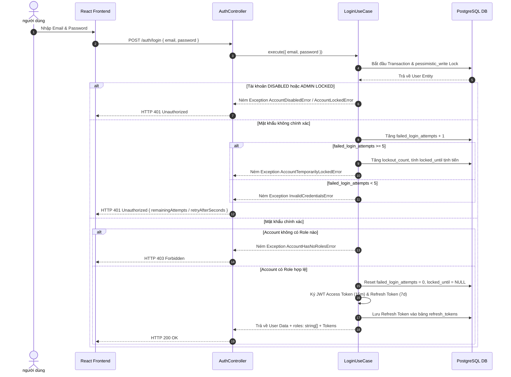

# ScoutBoard ⚽
> **Football Player Search, Comparison and Squad Building Platform**
> **Architecture: Modular Monolith + Clean Architecture (NestJS & React 19)**

**ScoutBoard** là một nền tảng Web Full-Stack hỗ trợ quản lý tài khoản, tìm kiếm, phân tích, so sánh cầu thủ và xây dựng đội hình bóng đá. Dự án được thiết kế và tái cấu trúc hoàn chỉnh theo mô hình **Modular Monolith + Clean Architecture**, đảm bảo phân định ranh giới phụ thuộc nghiêm ngặt (Dependency Rule), tối ưu hiệu năng cơ sở dữ liệu và tuân thủ các chuẩn mực của **Software Engineering**.

---

## 🎯 1. Tổng Quan Kiến Trúc & Quy Tắc Dữ Liệu

### **1.1. Kiến trúc Modular Monolith + Clean Architecture**
Hệ thống được tổ chức thành một ứng dụng NestJS duy nhất nhưng chia thành các module độc lập. Mỗi module tuân thủ cấu trúc 4 tầng Clean Architecture:

```text
src/modules/<feature>/
├── domain/            # Entities, Value Objects, Repository Interfaces, Domain Errors (Không dính NestJS/TypeORM)
├── application/       # Use Cases, Application Ports (Contracts cho PasswordHasher, TokenService)
├── infrastructure/    # Persistence (TypeORM Entities, Mappers, Repositories), Security (Bcrypt, JWT)
├── presentation/      # HTTP Controllers, DTOs, Guards, Strategies, Decorators
└── <feature>.module.ts
```

- **Ranh giới phụ thuộc (Dependency Rule)**: `Presentation` → `Application` → `Domain` ← `Infrastructure`.
- **Tách biệt Model**: Tầng `Domain` sử dụng các **Pure Domain Entities** (`User`, `Role`, `RefreshToken`) không có bất kỳ decorator nào của ORM. Tầng `Infrastructure` quản lý các **TypeORM ORM Entities** (`UserOrmEntity`, `RoleOrmEntity`, `UserRoleOrmEntity`, `RefreshTokenOrmEntity`) và ánh xạ qua lại bằng các **Mapper** (`UserMapper`, `RefreshTokenMapper`).

---

### **1.2. Kiến Trúc Multi-Provider Dữ Liệu Bóng Đá**

Hệ thống kết hợp nhiều nhà cung cấp dữ liệu bóng đá chuyên biệt hóa theo từng trách nhiệm:

```text
                           SCOUTBOARD
                                │
                      Canonical Domain Model
                                │
         ┌──────────────────────┼──────────────────────┐
         │                      │                      │
         ▼                      ▼                      ▼
 football-data.org         API-Football           Sportmonks
 -----------------         ------------           ----------
 Core Football Data     Player Enrichment      Match Statistics
 • Competitions/Seasons • Player Photos (CDN)  • Match Events/Ratings
 • Clubs & Rosters      • Height & Weight      • Player Match Stats
 • Match Fixtures       • Jersey Number & Photo• Detailed Performance
 • Scores & Results     • Detailed Positions
```

| Nhóm dữ liệu | Nguồn Provider | Trách nhiệm |
| :--- | :--- | :--- |
| **Core Football Data** | `football-data.org` | Giải đấu, Mùa giải, Câu lạc bộ, Đội hình cơ bản, Lịch thi đấu, Tỷ số trận đấu. |
| **Player Enrichment** | `API-Football` | Ảnh chân dung (CDN), Chiều cao, Cân nặng, Số áo, Vị trí chi tiết. (Lưu ý: API-Football không hỗ trợ Chân thuận/preferred_foot). |
| **Match Statistics** | `Sportmonks` | Thống kê chi tiết từng trận, Điểm số đánh giá (Ratings), Sự kiện trận đấu. |
| **User & App Data** | PostgreSQL (Internal) | Người dùng, Phân quyền RBAC, Shortlists cá nhân, Đội hình tự dựng (Squads). |

---

### **1.3. Phân quyền Người dùng (RBAC)**
- **GUEST:** Khách chưa đăng nhập có thể xem trang Giới thiệu (About/Home) và Tìm kiếm cầu thủ cơ bản (Find Players Basic).
- **USER:** Người dùng đã đăng nhập có quyền:
  - Xem trang Giới thiệu (About/Home)
  - Tìm kiếm cầu thủ cơ bản & Tìm kiếm nâng cao (Find Players Basic + Advanced Search qua `POST /api/players/query`)
  - Quản lý danh sách theo dõi cá nhân (My Shortlists)
  - Xây dựng đội hình chiến thuật (My Squads)
  - Quản lý hồ sơ cá nhân (Profile)
- **ADMIN:** Quản trị viên hệ thống có quyền:
  - Quản lý hồ sơ cá nhân (Profile)
  - Quản trị Người dùng (User Management: mở khóa tài khoản, kích hoạt/vô hiệu hóa, phân quyền)
  - Quản lý Đồng bộ Dữ liệu (Data Sync)
  *(Lưu ý: Tài khoản ADMIN bị giới hạn nghiêm ngặt và KHÔNG có quyền truy cập: About/Home, Find Players, Advanced Search, My Shortlists, My Squads).*

---

## 🛠 2. Công Nghệ Sử Dụng (Technology Stack)

### **Backend (API Service)**
- **Core Framework:** [NestJS 11](https://nestjs.com/) (Modular Monolith + Clean Architecture).
- **Language:** TypeScript 5.
- **Database & ORM:** PostgreSQL 17 + [TypeORM 0.3](https://typeorm.io/) (19 Migrations, Seeding, Transactions & Pessimistic Write Locks).
- **Authentication & Security:**
  - JWT (`@nestjs/jwt`, `passport-jwt`): Cấp phát Access Token (15m) & Refresh Token (7d).
  - `bcryptjs`: Mã hóa mật khẩu với Salt (10 rounds).
  - `crypto`: Băm SHA-256 đối chiếu Refresh Token.
  - **Progressive Account Lockout:** Khóa tịnh tiến tự động (5m -> 15m -> 60m -> Vô hiệu hóa) chống Brute-Force.
- **Validation & Transformation:** `class-validator` & `class-transformer` với Global `ValidationPipe`.
- **API Documentation:** OpenAPI 3.0 / Swagger (`@nestjs/swagger`).
- **Testing:** [Jest](https://jestjs.io/) (122 test suites, 674 unit & integration tests).

### **Frontend (Client Web App)**
- **Core Library:** [React 19](https://react.dev/) (Single Page Application - SPA).
- **Build Tool:** [Vite 8](https://vitejs.dev/) (Hot Module Replacement & Speed Opt).
- **Architecture & Performance:** Route-level Code Splitting (`React.lazy()` & `Suspense`), Component Decomposition (phân rã tách biệt UI render, custom hooks và business logic).
- **Data Visualization:** **Pure Vector SVG Radar Chart Engine** (0-dependency, responsive qua `viewBox`, đa giác lưới đồng tâm 5 cấp, radial spokes, SVG Linear Gradients & Glow Filters).
- **Styling:** Vanilla CSS3 + Custom Design Tokens (Dark Mode, Glassmorphism, EA FC HUD & Broadcast Micro-animations).
- **HTTP Client:** Fetch API chuẩn hóa với Countdown Timer thời gian thực.
- **Position & Role Categorization System:** Utility chuẩn hóa 4 nhóm vai trò (GK, DEF, MID, ATT) đồng bộ màu sắc và metrics giao diện.
- **Testing:** [Vitest 4](https://vitest.dev/) (282 pure unit test cases kiểm thử Radar Normalization, Squad Rules, Position Taxonomy, Advanced Query validation).

---

## 🧩 3. Chi Tiết Các Module & Tính Năng Đã Lập Trình

### **Module 1: Authentication & Security (`src/modules/auth`)**
1. **Đăng ký tài khoản (`POST /auth/register`):**
   - Kiểm tra trùng email qua `CreateUserUseCase`.
   - Hash mật khẩu bằng `BcryptPasswordHasher`.
   - Tạo user với trạng thái `ACTIVE` và gán mặc định role `USER`.
   - Phát hành cặp Access Token & Refresh Token.
2. **Đăng nhập với Progressive Lockout (`POST /auth/login`):**
   - Xử lý trong DB Transaction với `pessimistic_write` lock.
   - Kiểm tra trạng thái tài khoản (`DISABLED` / `LOCKED`).
   - Tự động reset thông tin sai nếu vượt Cửa sổ theo dõi (Observation Window 24h).
   - Đăng nhập sai: Tăng `failed_login_attempts`. Nếu vượt quá 5 lần, kích hoạt các bậc tạm khóa (`retryAfterSeconds`, `lockedUntil`).
   - Đăng nhập đúng: Reset toàn bộ chỉ số thử sai về 0, kiểm tra tài khoản phải có ít nhất 1 role (ném `AccountHasNoRolesError` nếu rỗng), phát hành cặp Token mới.
3. **Làm mới Token & Rotation (`POST /auth/refresh`):**
   - Băm SHA-256 và kiểm tra token trong bảng `refresh_tokens`.
   - Kiểm tra xem token đã bị thu hồi (`revokedAt`) hay chưa.
   - Đánh dấu thu hồi token cũ và cấp token mới (Token Rotation).
4. **Đăng xuất (`POST /auth/logout`):**
   - Đánh dấu thu hồi (`revokedAt = NOW()`) cho Refresh Token hiện tại.
5. **Lấy thông tin cá nhân (`GET /auth/me`):**
   - Trả về đối tượng `AuthenticatedUser` chuẩn hóa: `{ id, email, fullName, status, roles: string[] }`.

---

### **Module 2: Quản trị Người dùng - Admin Console (`src/modules/users`)**
1. **Danh sách người dùng cho Admin (`GET /admin/users`):**
   - Bảo vệ bởi `JwtAuthGuard` & `RolesGuard('ADMIN')`.
   - Tìm kiếm theo Tên/Email, lọc theo Status & Role.
2. **Cập nhật trạng thái người dùng (`PATCH /admin/users/:id/status`):**
   - Chuyển đổi trạng thái giữa `ACTIVE` và `DISABLED`.
   - **Ràng buộc an toàn:** Admin không thể tự vô hiệu hóa tài khoản của chính mình (`CannotDisableSelfError`).
   - Kích hoạt lại `ACTIVE` sẽ tự động xóa sạch dữ liệu bị tạm khóa.
3. **Mở khóa tài khoản thủ công (`PATCH /admin/users/:id/unlock`):**
   - Admin chủ động mở khóa cho các tài khoản đang bị hệ thống tạm khóa do nhập sai mật khẩu.
4. **Phân quyền người dùng (`PATCH /admin/users/:id/roles`):**
   - Gán/thu hồi các vai trò `ADMIN` / `USER`.

---

### **Module 3: Player Analytics & Scouting Intelligence (`src/modules/players`)**
1. **Tìm kiếm Cầu thủ Cơ bản (`GET /players`):**
   - Endpoint công khai (Public), hỗ trợ phân trang và lọc theo tên, giải đấu, CLB, quốc tịch, độ tuổi, chiều cao, cân nặng.
   - **Hỗ trợ Any Position Filter:** Khớp cả vị trí chính (`primaryPosition`) và các vị trí phụ liên kết (`player.positions`).
2. **Tìm kiếm Nâng cao (`POST /api/players/query`):**
   - Yêu cầu xác thực JWT (`Authorization: Bearer <token>`, cho phép `USER` và `ADMIN`).
   - Hỗ trợ cây logic Boolean (AND/OR), lọc chỉ số mùa giải, gom nhóm thống kê trận đấu (Match Aggregation) và xếp hạng phân vị theo vị trí (Cohort Comparison).
3. **Đảm bảo tính toàn vẹn vị trí (Position Integrity & Single Primary Rule):**
   - Bảng `player_positions` là source of truth với partial unique constraint `IDX_player_positions_one_primary_per_player`.
   - Cập nhật vị trí chính (`PATCH /players/:id/primary-position`): Dành riêng cho Quản trị viên (`ADMIN only`, bảo vệ bởi `JwtAuthGuard` & `RolesGuard('ADMIN')`), xử lý nguyên tử với pessimistic lock.
4. **Hero Banner theo Vai trò (Position-Aware Hero Card):**
   - Tự động thay đổi 2 chỉ số nổi bật theo vai trò:
     - **GK:** `SAVES` | `CLEAN SHEETS`
     - **DEF:** `TACKLES` | `INTERCEPTIONS`
     - **MID / ATT / Fallback:** `GOALS` | `ASSISTS`
4. **Biểu đồ Radar Đa giác Chiến thuật (Pure Vector SVG Tactical Radar Chart):**
   - Vẽ trực tiếp bằng toán học lượng giác và SVG Engine thuần (0 dependency).
   - Tự động hoán đổi 5 trục chiến thuật phù hợp với từng vai trò cầu thủ (GK, DEF, MID, ATT).
5. **So sánh Cầu thủ (`GET /players/comparison-candidates`):**
   - So sánh trực quan theo mùa giải hoặc tổng hợp toàn bộ giải đấu (`ALL COMPETITIONS`).

---

### **Module 4: ETL Read-Only Modules (`competitions`, `seasons`, `teams`, `matches`)**
- Áp dụng Clean Architecture Read-Only Repositories (`TeamReadRepository`, `MatchReadRepository`, v.v.).
- Quản lý lịch thi đấu, thống kê chi tiết từng trận đấu (Match Logs) và lịch sử chuyển nhượng (Career History).

---

## 🔄 4. Luồng Hoạt Động Hệ Thống (Architecture Sequence Flows)

### **Luồng Đăng Nhập & Kiểm Soát Khóa Tịnh Tiến (Login & Lockout Flow)**



---

## 📁 5. Cấu Trúc Thư Mục Mã Nguồn Nâng Cao (Project Structure)

```text
ScoutBoard/
├── backend/                       # RESTful API Backend (NestJS + TypeScript)
│   ├── src/
│   │   ├── modules/               # Modular Monolith Architecture
│   │   │   ├── auth/              # Module Xác thực & Bảo mật
│   │   │   │   ├── domain/        # RefreshToken Entity, Repositories, Errors, Constants
│   │   │   │   ├── application/   # Register, Login, RefreshTokens, Logout Use Cases & Ports
│   │   │   │   ├── infrastructure/# RefreshTokenOrmEntity, TypeOrmRefreshTokenRepository, Security Services
│   │   │   │   ├── presentation/  # AuthController, DTOs, JwtAuthGuard, RolesGuard, JwtStrategy
│   │   │   │   └── auth.module.ts
│   │   │   ├── users/             # Module Quản lý Người dùng
│   │   │   │   ├── domain/        # User Entity, Role Entity, UserRepository, Users Errors
│   │   │   │   ├── application/   # CreateUser, GetUserById, UpdateUserStatus, UnlockUser, UpdateUserRoles Use Cases
│   │   │   │   ├── infrastructure/# UserOrmEntity, RoleOrmEntity, UserRoleOrmEntity, TypeOrmUserRepository, UserMapper
│   │   │   │   ├── presentation/  # UsersController, Admin User DTOs
│   │   │   │   └── users.module.ts
│   │   │   ├── competitions/      # Module Competitions (ETL Read-Only)
│   │   │   ├── seasons/           # Module Seasons (ETL Read-Only)
│   │   │   ├── teams/             # Module Teams (ETL Read-Only)
│   │   │   ├── players/           # Module Players (ETL Read-Only)
│   │   │   └── matches/           # Module Matches (ETL Read-Only)
│   │   ├── database/              # TypeORM Migrations, App Seeders & DataSource Configuration
│   │   ├── app.module.ts          # Root AppModule
│   │   └── main.ts                # Application Entrypoint
│   ├── package.json
│   └── tsconfig.json
│
├── frontend/                      # Web Client Application (React 19 + Vite)
│   ├── src/
│   │   ├── services/
│   │   │   └── api.ts             # Service gọi REST API (Đã nâng cấp UserProfile với roles: string[])
│   │   ├── App.tsx                # Main SPA Component (Admin Check: user?.roles?.includes('ADMIN'))
│   │   ├── App.css
│   │   ├── index.css
│   │   └── main.tsx
│   ├── package.json
│   └── vite.config.ts
│
├── docker-compose.yml             # Containerization cho PostgreSQL 17 & PgAdmin 4
├── CURRENT_ARCHITECTURE_ANALYSIS.md # Tài liệu Phân tích Kiến trúc Chi tiết
├── DATA_OWNERSHIP.md              # Tài liệu Quy định Sở hữu Dữ liệu Backend & ETL
└── README.md                      # Tài liệu Kỹ thuật Tổng quan
```

---

## 🚀 6. Hướng Dẫn Khởi Chạy Ứng Dụng (Getting Started)

### **Yêu cầu môi trường (Prerequisites)**
- **Node.js**: v18.0.0 trở lên
- **npm**: v9.0.0 trở lên
- **Docker & Docker Compose**

---

### **Bước 1: Khởi chạy PostgreSQL bằng Docker**
Tại thư mục gốc dự án (`ScoutBoard/`):

```bash
docker-compose up -d
```
- **PostgreSQL 17**: `localhost:5432` (`db: scoutboard_db`, `user: postgres`, `pass: postgres123`).
- **PgAdmin 4 UI**: `http://localhost:8080` (`admin@scoutboard.com` / `admin123`).

---

### **Bước 2: Khởi chạy Backend (NestJS)**

```bash
cd backend
npm install

# (Tùy chọn) Seed dữ liệu mặc định cho Roles & Admin
npm run seed

# Khởi chạy Development Server
npm run start:dev
```
- REST API Server running at: **`http://localhost:3000`**

---

### **Bước 3: Khởi chạy Frontend (React + Vite)**

```bash
cd frontend
npm install
npm run dev
```
- Client Web App running at: **`http://localhost:5173`**

---

---

## 📊 7. Các Công Thức Nghiệp Vụ & Visualization Engine

### **7.1. Công thức Tỷ Lệ Chuyền Chính Xác (Pass Accuracy)**
$$\text{Pass Accuracy (\%)} = \begin{cases} \left( \dfrac{\sum \text{passes\_completed}}{\sum \text{passes\_attempted}} \right) \times 100 & \text{khi } \text{passes\_attempted} > 0 \\ \text{null} & \text{khi } \text{passes\_attempted} = 0 \end{cases}$$

### **7.2. Công thức Chuẩn Hóa Chỉ Số Theo 90 Phút (Per-90 Normalization)**
$$\text{Metric Per 90} = \begin{cases} \dfrac{\text{Raw Metric Value} \times 90}{\text{Minutes Played}} & \text{khi } \text{Minutes Played} > 0 \\ \text{null} & \text{khi } \text{Minutes Played} = 0 \end{cases}$$

### **7.3. Động Cơ Vẽ Biểu Đồ Radar Thuần Vector (Pure SVG Radar Geometry Engine)**
Biểu đồ Radar được dựng hoàn toàn bằng toán học lượng giác và SVG nguyên bản (`<polygon>`, `<line>`, `<circle>`, `<text>`):
- **Chuyển đổi Tọa độ Cực sang Tọa độ Descartes:**
  $$x = x_{\text{center}} + r \cdot \cos(\theta), \quad y = y_{\text{center}} + r \cdot \sin(\theta)$$
  Trong đó:
  - $x_{\text{center}} = y_{\text{center}} = 150\text{px}$, bán kính tối đa $R = 95\text{px}$.
  - Góc khởi tạo đỉnh trên cùng: $\theta_0 = -\frac{\pi}{2}$.
  - Bước góc giữa 5 trục đa giác: $\Delta \theta = \frac{2\pi}{5} = 72^\circ$.

### **7.4. Công thức Chuẩn Hóa Thang Điểm 0–100 cho Radar (Linear Min-Max Normalization)**
Không phụ thuộc Percentile hay truy vấn so sánh toàn bộ quần thể, mỗi chỉ số được chuẩn hóa cục bộ tại Frontend dựa trên ngưỡng thực tế trong bóng đá chuyên nghiệp:
$$\text{Score} = \text{clamp}\left( \dfrac{\text{val} - \text{min}}{\text{max} - \text{min}} \times 100, 0, 100 \right)$$
Đối với chỉ số nghịch đảo (như số bàn thua trung bình mỗi trận của Thủ môn):
$$\text{Score}_{\text{inverse}} = 100 - \text{clamp}\left( \dfrac{\text{val} - \text{min}}{\text{max} - \text{min}} \times 100, 0, 100 \right)$$

#### **Bảng Thang Đo Chiến Thuật theo Nhóm Vị Trí:**
| Nhóm vai trò | Trục chiến thuật (Axis) | Chỉ số nguồn (Source Metric) | Thang đo chuẩn $[\text{min}, \text{max}]$ |
| :--- | :--- | :--- | :--- |
| **Goalkeeper (GK)** | **SHOT STOPPING**<br>**CLEAN SHEETS**<br>**DISTRIBUTION**<br>**GOAL PREVENTION**<br>**PENALTY STOPPING** | `savesPer90`<br>`cleanSheets`<br>`passAccuracy`<br>`goalsConcededPer90`<br>`penaltiesSaved` | $[0, 5.0] \text{ saves/90}$<br>$[0, 16] \text{ clean sheets}$<br>$[40\%, 90\%]$<br>$[0.6, 2.4] \text{ GA/90 (nghịch đảo)}$<br>$[0, 3] \text{ penalties saved}$ |
| **Defender (DEF)** | **TACKLING**<br>**INTERCEPTIONS**<br>**DUEL ABILITY**<br>**PASS ACCURACY**<br>**BUILD-UP** | `tacklesPer90`<br>`interceptionsPer90`<br>`duelsWonPer90`<br>`passAccuracy`<br>`passesPer90` | $[0, 3.5] \text{ tackles/90}$<br>$[0, 2.5] \text{ int/90}$<br>$[0, 7.0] \text{ duels/90}$<br>$[60\%, 95\%]$<br>$[0, 75] \text{ passes/90}$ |
| **Midfielder (MID)** | **PASS VOLUME**<br>**PASS ACCURACY**<br>**CREATIVITY**<br>**RECOVERY**<br>**GOAL THREAT** | `passesPer90`<br>`passAccuracy`<br>`keyPassesPer90`<br>`tacklesPer90 + interceptionsPer90`<br>`goalsPer90 + assistsPer90` | $[0, 80] \text{ passes/90}$<br>$[65\%, 95\%]$<br>$[0, 3.0] \text{ KP/90}$<br>$[0, 4.5] \text{ actions/90}$<br>$[0, 0.8] \text{ G+A/90}$ |
| **Attacker (ATT)** | **SCORING**<br>**SHOOTING**<br>**ON TARGET**<br>**CHANCE CREATION**<br>**PLAYMAKING** | `goalsPer90`<br>`shotsPer90`<br>`shotsOnTargetPer90`<br>`keyPassesPer90`<br>`assistsPer90` | $[0, 1.0] \text{ goals/90}$<br>$[0, 4.5] \text{ shots/90}$<br>$[0, 2.0] \text{ SoT/90}$<br>$[0, 2.8] \text{ KP/90}$<br>$[0, 0.5] \text{ assists/90}$ |

---

## 🧪 8. Kiểm Thử Tự Động & Quality Checks (Test Suite)

Dự án tích hợp bộ kiểm thử tự động toàn diện cho cả Backend (Jest) và Frontend (Vitest):

```bash
# Backend (Jest - Use Cases, Domain Entities, Controllers, Integration)
cd backend
npm run test
npm run lint
npm run build

# Frontend (Vitest - Radar, Squad Placement, Position Taxonomy, Query Composition)
cd frontend
npm run test
npm run build
```

### Kết quả kiểm thử tự động:
```text
Backend Tests (Jest):     122 suites passed, 674 tests passed (100%)
Frontend Tests (Vitest):  5 test files passed, 282 tests passed (100%)
Total Automated Tests:    956 tests passed (100%)
Backend Build:            100% PASSED (nest build)
Frontend Build:           100% PASSED (tsc -b && vite build)
```

---
*Tài liệu được cập nhật chuẩn mực dựa trên mã nguồn kiến trúc Modular Monolith + Clean Architecture của dự án ScoutBoard.*
