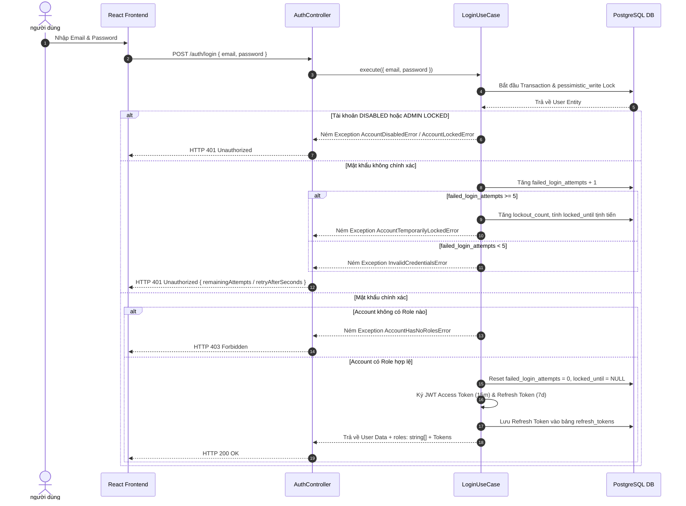

# ScoutBoard ⚽
> **Football Player Search, Comparison and Squad Building Platform**
> **Architecture: Modular Monolith + Clean Architecture (NestJS & React 19)**

**ScoutBoard** là một nền tảng Web Full-Stack hỗ trợ quản lý tài khoản, tìm kiếm, phân tích, so sánh cầu thủ và xây dựng đội hình bóng đá. Dự án được thiết kế và tái cấu trúc hoàn chỉnh theo mô hình **Modular Monolith + Clean Architecture**, đảm bảo phân định ranh giới phụ thuộc nghiêm ngặt (Dependency Rule), tối ưu hiệu năng cơ sở dữ liệu và tuân thủ các chuẩn mực của **Software Engineering**.

---

## 🎯 1. Tổng Quan Kiến Trúc & Quy Tắc Dữ Liệu

### **1.1. Kiến trúc Modular Monolith + Clean Architecture**
Hệ thống được tổ chức thành một ứng dụng NestJS duy nhất nhưng chia thành các module độc lập. Mỗi module tuân thủ cấu trúc 4 tầng Clean Architecture:

```text
src/modules/<feature>/
├── domain/            # Entities, Value Objects, Repository Interfaces, Domain Errors (Không dính NestJS/TypeORM)
├── application/       # Use Cases, Application Ports (Contracts cho PasswordHasher, TokenService)
├── infrastructure/    # Persistence (TypeORM Entities, Mappers, Repositories), Security (Bcrypt, JWT)
├── presentation/      # HTTP Controllers, DTOs, Guards, Strategies, Decorators
└── <feature>.module.ts
```

- **Ranh giới phụ thuộc (Dependency Rule)**: `Presentation` → `Application` → `Domain` ← `Infrastructure`.
- **Tách biệt Model**: Tầng `Domain` sử dụng các **Pure Domain Entities** (`User`, `Role`, `RefreshToken`) không có bất kỳ decorator nào của ORM. Tầng `Infrastructure` quản lý các **TypeORM ORM Entities** (`UserOrmEntity`, `RoleOrmEntity`, `UserRoleOrmEntity`, `RefreshTokenOrmEntity`) và ánh xạ qua lại bằng các **Mapper** (`UserMapper`, `RefreshTokenMapper`).

---

### **1.2. Quy tắc Phân định Sở hữu Dữ liệu (Data Ownership)**

Hệ thống được phân định quyền sở hữu dữ liệu tuyệt đối giữa Backend và hệ thống ETL bên ngoài:

| Nhóm dữ liệu | Bảng dữ liệu | Đơn vị sở hữu | Quyền hạn của Backend |
| :--- | :--- | :--- | :--- |
| **Backend-Owned Data** | `users`, `roles`, `user_roles`, `refresh_tokens` | **Backend App** | Toàn quyền Read/Write, Giao dịch (Transactions), Pessimistic Locking & Khóa tịnh tiến |
| **ETL-Owned Data** | `competitions`, `seasons`, `teams`, `players`, `matches` | **ETL Pipeline** | **Read-Only Clean Architecture**. Backend KHÔNG ghi dữ liệu, KHÔNG có API Mutation, Sync Job hay Ingest External API |

---

### **1.3. Phân quyền Người dùng (RBAC)**
- **GUEST:** Khách chưa đăng nhập có thể tìm kiếm, xem chi tiết và so sánh cầu thủ.
- **USER:** Người dùng đã đăng nhập có quyền GUEST + Quản lý Shortlist & Squad Builder.
- **ADMIN:** Quản trị viên có quyền USER + Quản trị Người dùng (Admin Console), phân quyền và mở khóa tài khoản.

---

## 🛠 2. Công Nghệ Sử Dụng (Technology Stack)

### **Backend (API Service)**
- **Core Framework:** [NestJS 11](https://nestjs.com/) (Modular Monolith + Clean Architecture).
- **Language:** TypeScript 5.
- **Database & ORM:** PostgreSQL 17 + [TypeORM 0.3](https://typeorm.io/) (Migrations, Seeding, Transactions & Pessimistic Write Locks).
- **Authentication & Security:**
  - JWT (`@nestjs/jwt`, `passport-jwt`): Cấp phát Access Token (15m) & Refresh Token (7d).
  - `bcryptjs`: Mã hóa mật khẩu với Salt (10 rounds).
  - `crypto`: Băm SHA-256 đối chiếu Refresh Token.
  - **Progressive Account Lockout:** Khóa tịnh tiến tự động (5m -> 15m -> 60m -> Vô hiệu hóa) chống Brute-Force.
- **Validation & Transformation:** `class-validator` & `class-transformer` với Global `ValidationPipe`.
- **API Documentation:** OpenAPI 3.0 / Swagger (`@nestjs/swagger`).

### **Frontend (Client Web App)**
- **Core Library:** [React 19](https://react.dev/) (Single Page Application - SPA).
- **Build Tool:** [Vite 8](https://vitejs.dev/) (Hot Module Replacement & Speed Opt).
- **Styling:** Vanilla CSS3 + Custom Design Tokens (Dark Mode, Glassmorphism, Micro-animations).
- **HTTP Client:** Fetch API chuẩn hóa với Countdown Timer thời gian thực.

---

## 🧩 3. Chi Tiết Các Module & Tính Năng Đã Lập Trình

### **Module 1: Authentication & Security (`src/modules/auth`)**
1. **Đăng ký tài khoản (`POST /auth/register`):**
   - Kiểm tra trùng email qua `CreateUserUseCase`.
   - Hash mật khẩu bằng `BcryptPasswordHasher`.
   - Tạo user với trạng thái `ACTIVE` và gán mặc định role `USER`.
   - Phát hành cặp Access Token & Refresh Token.
2. **Đăng nhập với Progressive Lockout (`POST /auth/login`):**
   - Xử lý trong DB Transaction với `pessimistic_write` lock.
   - Kiểm tra trạng thái tài khoản (`DISABLED` / `LOCKED`).
   - Tự động reset thông tin sai nếu vượt Cửa sổ theo dõi (Observation Window 24h).
   - Đăng nhập sai: Tăng `failed_login_attempts`. Nếu vượt quá 5 lần, kích hoạt các bậc tạm khóa (`retryAfterSeconds`, `lockedUntil`).
   - Đăng nhập đúng: Reset toàn bộ chỉ số thử sai về 0, kiểm tra tài khoản phải có ít nhất 1 role (ném `AccountHasNoRolesError` nếu rỗng), phát hành cặp Token mới.
3. **Làm mới Token & Rotation (`POST /auth/refresh`):**
   - Băm SHA-256 và kiểm tra token trong bảng `refresh_tokens`.
   - Kiểm tra xem token đã bị thu hồi (`revokedAt`) hay chưa.
   - Đánh dấu thu hồi token cũ và cấp token mới (Token Rotation).
4. **Đăng xuất (`POST /auth/logout`):**
   - Đánh dấu thu hồi (`revokedAt = NOW()`) cho Refresh Token hiện tại.
5. **Lấy thông tin cá nhân (`GET /auth/me`):**
   - Trả về đối tượng `AuthenticatedUser` chuẩn hóa: `{ id, email, fullName, status, roles: string[] }`.

---

### **Module 2: Quản trị Người dùng - Admin Console (`src/modules/users`)**
1. **Danh sách người dùng cho Admin (`GET /admin/users`):**
   - Bảo vệ bởi `JwtAuthGuard` & `RolesGuard('ADMIN')`.
   - Tìm kiếm theo Tên/Email, lọc theo Status & Role.
2. **Cập nhật trạng thái người dùng (`PATCH /admin/users/:id/status`):**
   - Chuyển đổi trạng thái giữa `ACTIVE` và `DISABLED`.
   - **Ràng buộc an toàn:** Admin không thể tự vô hiệu hóa tài khoản của chính mình (`CannotDisableSelfError`).
   - Kích hoạt lại `ACTIVE` sẽ tự động xóa sạch dữ liệu bị tạm khóa.
3. **Mở khóa tài khoản thủ công (`PATCH /admin/users/:id/unlock`):**
   - Admin chủ động mở khóa cho các tài khoản đang bị hệ thống tạm khóa do nhập sai mật khẩu.
4. **Phân quyền người dùng (`PATCH /admin/users/:id/roles`):**
   - Gán/thu hồi các vai trò `ADMIN` / `USER`.

---

### **Module 3: ETL Read-Only Modules (`competitions`, `seasons`, `teams`, `players`, `matches`)**
- Áp dụng Clean Architecture Read-Only Repositories (`PlayerReadRepository`, `TeamReadRepository`, v.v.).
- Cung cấp các API tìm kiếm, lọc, danh sách dữ liệu bóng đá cho Frontend tiêu thụ.

---

## 🔄 4. Luồng Hoạt Động Hệ Thống (Architecture Sequence Flows)

### **Luồng Đăng Nhập & Kiểm Soát Khóa Tịnh Tiến (Login & Lockout Flow)**



---

## 📁 5. Cấu Trúc Thư Mục Mã Nguồn Nâng Cao (Project Structure)

```text
ScoutBoard/
├── backend/                       # RESTful API Backend (NestJS + TypeScript)
│   ├── src/
│   │   ├── modules/               # Modular Monolith Architecture
│   │   │   ├── auth/              # Module Xác thực & Bảo mật
│   │   │   │   ├── domain/        # RefreshToken Entity, Repositories, Errors, Constants
│   │   │   │   ├── application/   # Register, Login, RefreshTokens, Logout Use Cases & Ports
│   │   │   │   ├── infrastructure/# RefreshTokenOrmEntity, TypeOrmRefreshTokenRepository, Security Services
│   │   │   │   ├── presentation/  # AuthController, DTOs, JwtAuthGuard, RolesGuard, JwtStrategy
│   │   │   │   └── auth.module.ts
│   │   │   ├── users/             # Module Quản lý Người dùng
│   │   │   │   ├── domain/        # User Entity, Role Entity, UserRepository, Users Errors
│   │   │   │   ├── application/   # CreateUser, GetUserById, UpdateUserStatus, UnlockUser, UpdateUserRoles Use Cases
│   │   │   │   ├── infrastructure/# UserOrmEntity, RoleOrmEntity, UserRoleOrmEntity, TypeOrmUserRepository, UserMapper
│   │   │   │   ├── presentation/  # UsersController, Admin User DTOs
│   │   │   │   └── users.module.ts
│   │   │   ├── competitions/      # Module Competitions (ETL Read-Only)
│   │   │   ├── seasons/           # Module Seasons (ETL Read-Only)
│   │   │   ├── teams/             # Module Teams (ETL Read-Only)
│   │   │   ├── players/           # Module Players (ETL Read-Only)
│   │   │   └── matches/           # Module Matches (ETL Read-Only)
│   │   ├── database/              # TypeORM Migrations, App Seeders & DataSource Configuration
│   │   ├── app.module.ts          # Root AppModule
│   │   └── main.ts                # Application Entrypoint
│   ├── package.json
│   └── tsconfig.json
│
├── frontend/                      # Web Client Application (React 19 + Vite)
│   ├── src/
│   │   ├── services/
│   │   │   └── api.ts             # Service gọi REST API (Đã nâng cấp UserProfile với roles: string[])
│   │   ├── App.tsx                # Main SPA Component (Admin Check: user?.roles?.includes('ADMIN'))
│   │   ├── App.css
│   │   ├── index.css
│   │   └── main.tsx
│   ├── package.json
│   └── vite.config.ts
│
├── docker-compose.yml             # Containerization cho PostgreSQL 17 & PgAdmin 4
├── CURRENT_ARCHITECTURE_ANALYSIS.md # Tài liệu Phân tích Kiến trúc Chi tiết
├── DATA_OWNERSHIP.md              # Tài liệu Quy định Sở hữu Dữ liệu Backend & ETL
└── README.md                      # Tài liệu Kỹ thuật Tổng quan
```

---

## 🚀 6. Hướng Dẫn Khởi Chạy Ứng Dụng (Getting Started)

### **Yêu cầu môi trường (Prerequisites)**
- **Node.js**: v18.0.0 trở lên
- **npm**: v9.0.0 trở lên
- **Docker & Docker Compose**

---

### **Bước 1: Khởi chạy PostgreSQL bằng Docker**
Tại thư mục gốc dự án (`ScoutBoard/`):

```bash
docker-compose up -d
```
- **PostgreSQL 17**: `localhost:5432` (`db: scoutboard_db`, `user: postgres`, `pass: postgres123`).
- **PgAdmin 4 UI**: `http://localhost:8080` (`admin@scoutboard.com` / `admin123`).

---

### **Bước 2: Khởi chạy Backend (NestJS)**

```bash
cd backend
npm install

# (Tùy chọn) Seed dữ liệu mặc định cho Roles & Admin
npm run seed

# Khởi chạy Development Server
npm run start:dev
```
- REST API Server running at: **`http://localhost:3000`**

---

### **Bước 3: Khởi chạy Frontend (React + Vite)**

```bash
cd frontend
npm install
npm run dev
```
- Client Web App running at: **`http://localhost:5173`**

---

## 🧪 7. Kiểm Thử Tự Động & Quality Checks (Test Suite)

Dự án tích hợp bộ unit test toàn diện cho tất cả Use Cases, Domain Entities và Controllers:

```bash
cd backend

# Chạy toàn bộ bộ test tự động (12 Test Suites, 32 Tests)
npm run test

# Kiểm tra Linter & Sửa lỗi tự động
npm run lint

# Biên dịch kiểm tra lỗi Type Build
npm run build
```

### Kết quả kiểm thử tự động:
```text
Test Suites: 12 passed, 12 total
Tests:       32 passed, 32 total
Snapshots:   0 total
Time:        3.178 s
Build:       100% PASSED (nest build)
Lint:        100% PASSED (0 errors, 0 warnings)
```

---
*Tài liệu được cập nhật chuẩn mực dựa trên mã nguồn kiến trúc Modular Monolith + Clean Architecture của dự án ScoutBoard.*
