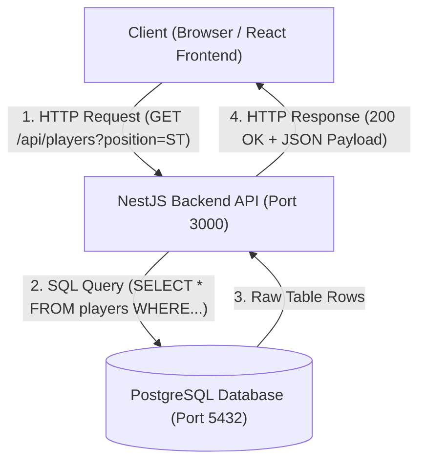
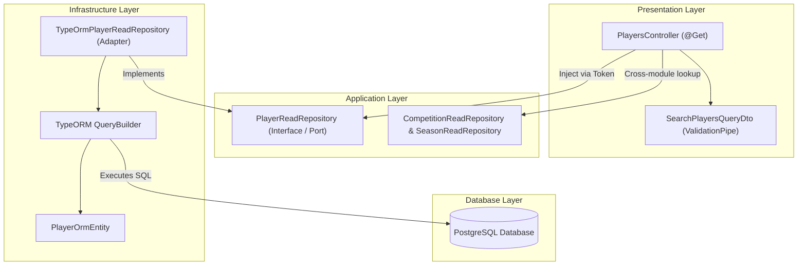
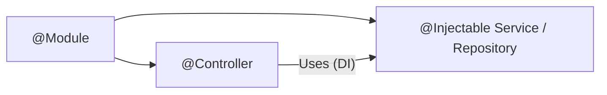
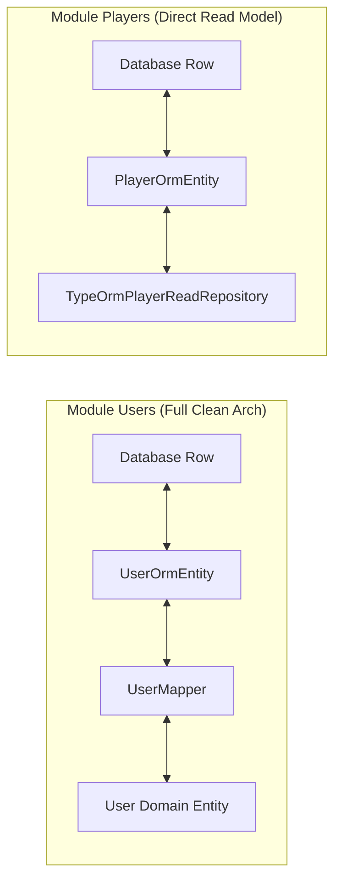
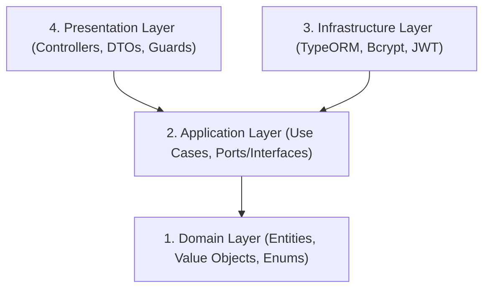
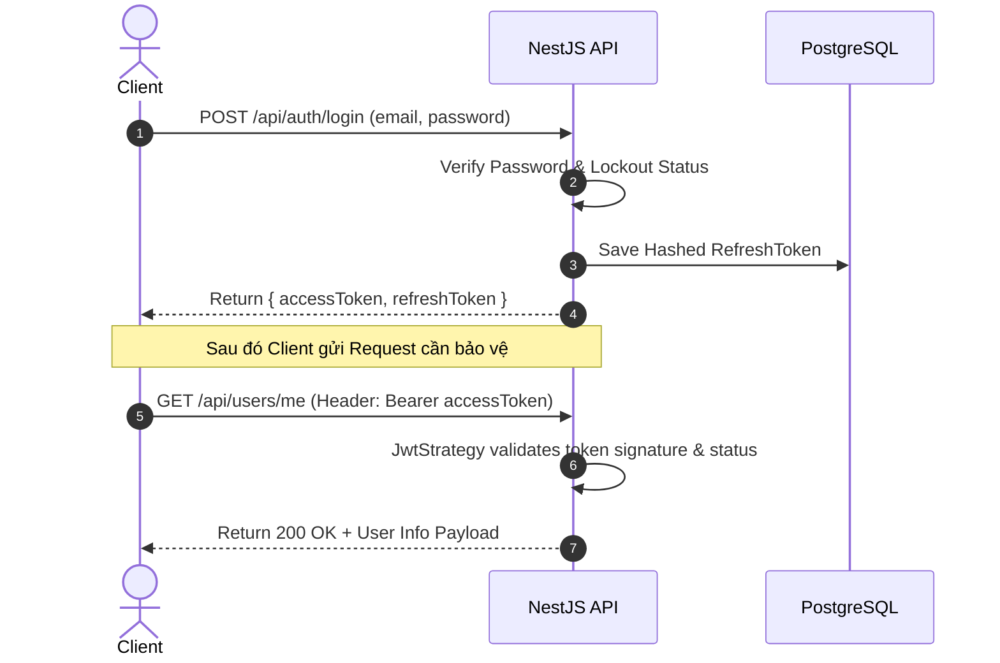
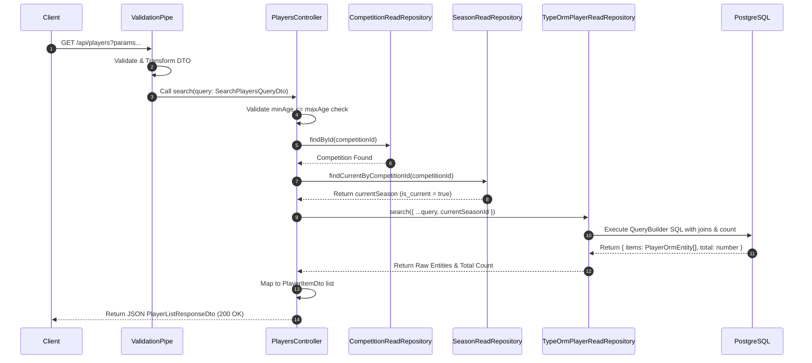
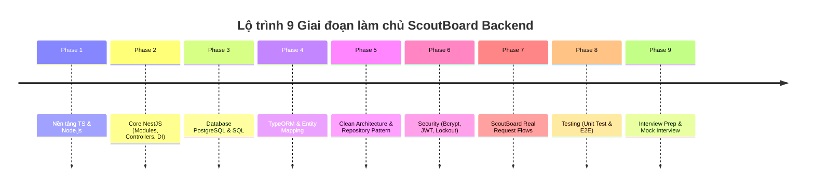

# SCOUTBOARD BACKEND STUDY GUIDE
> **Tài liệu hướng dẫn tự học toàn bộ Backend ScoutBoard từ nền tảng đến kiến trúc & phỏng vấn**  
> *Dành riêng cho Developer cần làm chủ codebase ScoutBoard hiện tại (NestJS, TypeORM, PostgreSQL, Clean Architecture)*

---

## MỤC LỤC
1. [Chương 0: Bản đồ toàn bộ ScoutBoard](#chuong-0-ban-do-toan-bo-scoutboard)
2. [Chương 1: Nền tảng JavaScript / TypeScript / Node.js](#chuong-1-nen-tang-javascript--typescript--nodejs)
3. [Chương 2: HTTP, REST API và Backend Fundamentals](#chuong-2-http-rest-api-va-backend-fundamentals)
4. [Chương 3: NestJS từ cơ bản đến Project](#chuong-3-nestjs-tu-co-ban-den-project)
5. [Chương 4: DTO và Validation](#chuong-4-dto-va-validation)
6. [Chương 5: Database cơ bản](#chuong-5-database-co-ban)
7. [Chương 6: ORM và TypeORM](#chuong-6-orm-va-typeorm)
8. [Chương 7: Entity vs Domain Entity vs ORM Entity](#chuong-7-entity-vs-domain-entity-vs-orm-entity)
9. [Chương 8: Clean Architecture trong ScoutBoard](#chuong-8-clean-architecture-trong-scoutboard)
10. [Chương 9: Repository Pattern](#chuong-9-repository-pattern)
11. [Chương 10: Ports and Adapters (Hexagonal Architecture)](#chuong-10-ports-and-adapters-hexagonal-architecture)
12. [Chương 11: Dependency Injection (DI) trong NestJS](#chuong-11-dependency-injection-di-trong-nestjs)
13. [Chương 12: Authentication và Authorization](#chuong-12-authentication-va-authorization)
14. [Chương 13: Password Hashing và Bcrypt](#chuong-13-password-hashing-va-bcrypt)
15. [Chương 14: JWT (JSON Web Token)](#chuong-14-jwt-json-web-token)
16. [Chương 15: Passport, Strategy và Guard](#chuong-15-passport-strategy-va-guard)
17. [Chương 16: RBAC, Roles và User Status](#chuong-16-rbac-roles-va-user-status)
18. [Chương 17: Login Lockout và Security Deep-dive](#chuong-17-login-lockout-va-security-deep-dive)
19. [Chương 18: Database Migration](#chuong-18-database-migration)
20. [Chương 19: Database Seed](#chuong-19-database-seed)
21. [Chương 20: Các quan hệ bóng đá trong Database ScoutBoard](#chuong-20-cac-quan-he-bong-da-trong-database-scoutboard)
22. [Chương 21: Case Study — Basic Player Search (GET /api/players)](#chuong-21-case-study--basic-player-search-get-apiplayers)
23. [Chương 22: Request Flow chi tiết từng bước: Player Search](#chuong-22-request-flow-chi-tiet-tung-buoc-player-search)
24. [Chương 23: TypeORM QueryBuilder Deep-dive](#chuong-23-typeorm-querybuilder-deep-dive)
25. [Chương 24: Chi tiết từng Filter trong Player Search](#chuong-24-chi-tiet-tung-filter-trong-player-search)
26. [Chương 25: SQL Join, Distinct và bài toán Duplicate Record](#chuong-25-sql-join-distinct-va-bai-toan-duplicate-record)
27. [Chương 26: Flow chuyển đổi CompetitionId → Current SeasonId](#chuong-26-flow-chuyen-doi-competitionid--current-seasonid)
28. [Chương 27: Error Handling & Exception Management](#chuong-27-error-handling--exception-management)
29. [Chương 28: Testing Strategy (Unit Test & E2E Test)](#chuong-28-testing-strategy-unit-test--e2e-test)
30. [Chương 29: Docker & Containerization](#chuong-29-docker--containerization)
31. [Chương 30: Swagger & API Documentation](#chuong-30-swagger--api-documentation)
32. [Chương 31: Quản lý Biến môi trường (Environment Variables)](#chuong-31-quan-ly-bien-moi-truong-environment-variables)
33. [Chương 32: Tổng hợp các Design Pattern đang áp dụng](#chuong-32-tong-hop-cac-design-pattern-dang-ap-dung)
34. [Chương 33: Module-by-Module Map](#chuong-33-module-by-module-map)
35. [Chương 34: Cấu trúc thư mục & File Map](#chuong-34-cau-truc-thu-muc--file-map)
36. [Chương 35: Phương pháp đọc và làm chủ một Feature mới](#chuong-35-phuong-phap-doc-va-lam-chu-mot-feature-moi)
37. [Chương 36: Quy trình Debug khi API trả về dữ liệu sai](#chuong-36-quy-trinh-debug-khi-api-tra-ve-du-lieu-sai)
38. [Chương 37: 80+ Câu hỏi Phỏng vấn Backend ScoutBoard (Có đáp án)](#chuong-37-80-cau-hoi-phong-van-backend-scoutboard-co-dap-an)
39. [Chương 38: Mẫu kịch bản "Giải thích Project trong phỏng vấn"](#chuong-38-mau-kich-ban-giai-thich-project-trong-phong-van)
40. [Chương 39: Checklist tự đánh giá năng lực](#chuong-39-checklist-tu-danh-gia-nang-luc)
41. [Chương 40: 30+ Bài tập thực hành tự kiểm tra](#chuong-40-30-bai-tap-thuc-hanh-tu-kiem-tra)
42. [Chương 41: Mini Quizzes (Kèm đáp án ẩn)](#chuong-41-mini-quizzes-kem-dap-an-an)
43. [Chương 42: Lộ trình học 9 giai đoạn (Study Roadmap)](#chuong-42-lo-trinh-hoc-9-giai-doan-study-roadmap)
44. [Chương 43: Kế hoạch hành động 14 ngày (14-Day Study Plan)](#chuong-44-ke-hoach-hanh-dong-14-ngay-14-day-study-plan)
45. [Chương 44: Thuật ngữ Backend (Glossary)](#chuong-45-thuat-ngu-backend-glossary)

---

## CHƯƠNG 0: BẢN ĐỒ TOÀN BỘ SCOUTBOARD

### 0.1 ScoutBoard Backend là gì?
ScoutBoard là hệ thống nền tảng phục vụ việc tìm kiếm, phân tích, so sánh cầu thủ và xây dựng đội hình bóng đá.
- **Frontend (Next.js / React)**: Đảm nhận giao diện người dùng, gửi yêu cầu HTTP và hiển thị danh sách cầu thủ, biểu đồ thống kê.
- **NestJS Backend (Node.js)**: Đảm nhận xử lý logic nghiệp vụ, xác thực người dùng (Auth), kiểm tra tính hợp lệ của dữ liệu (Validation), truy vấn dữ liệu bóng đá phức tạp từ Database và trả về định dạng JSON.
- **PostgreSQL Database**: Nơi lưu trữ persistent (lâu dài) toàn bộ dữ liệu người dùng, đội bóng, giải đấu, mùa giải, cầu thủ và chỉ số thống kê.
- **REST API**: Giao thức kết nối giữa Frontend và Backend thông qua định dạng chuẩn JSON qua giao thức HTTP.



### 0.2 Kiến trúc Luồng xử lý Thực tế trong ScoutBoard Backend



---

## CHƯƠNG 1: NỀN TẢNG JAVASCRIPT / TYPESCRIPT / NODE.JS

### 1.1 Các khái niệm cơ bản
1. **JavaScript (JS)**: Ngôn ngữ lập trình động (dynamically typed) chạy trên trình duyệt hoặc môi trường Node.js.
2. **TypeScript (TS)**: Bản mở rộng (superset) của JavaScript, bổ sung **Static Typing** (kiểu dữ liệu tĩnh). TypeScript biên dịch thành JavaScript thuần trước khi chạy.
3. **TypeScript khác JavaScript ra sao?**:
   - JS phát hiện lỗi kiểu dữ liệu lúc **Runtime** (khi chương trình đang chạy).
   - TS phát hiện lỗi kiểu dữ liệu ngay lúc **Compile-time** (khi viết code).
4. **Node.js**: Môi trường thực thi JavaScript (Runtime Environment) phía Server dựa trên Google V8 Engine. **Node.js KHÔNG phải là framework**, nó là runtime.
5. **npm (Node Package Manager)**: Bộ quản lý thư viện mã nguồn mở cho Node.js.
6. **package.json**: File khai báo thông tin dự án, cấu hình script và danh sách các thư viện phụ thuộc (dependencies).
7. **node_modules**: Thư mục chứa mã nguồn của toàn bộ thư viện bên ngoài được npm tải về.
8. **Dependencies vs DevDependencies**:
   - `dependencies`: Thư viện cần thiết khi app chạy trên Production (ví dụ: `@nestjs/core`, `typeorm`, `pg`, `bcryptjs`).
   - `devDependencies`: Thư viện chỉ dùng khi lập trình và build (ví dụ: `typescript`, `jest`, `@types/node`, `eslint`).
9. **import/export**: Cú pháp ES Modules để chia sẻ mã giữa các file (`export class User...` / `import { User } from '...'`).

### 1.2 TypeScript Deep-dive trong ScoutBoard

#### Class, Interface, Type và Enum
- **Class**: Khuôn mẫu tạo object có thuộc tính và phương thức.
- **Interface**: Hợp đồng định nghĩa cấu trúc của object (chỉ tồn tại ở thời điểm compile TS, bị xóa hoàn toàn khi sang JS).
- **Type**: Định danh một dạng kiểu dữ liệu (Primitive, Union, Object).
- **Enum**: Tập hợp các hằng số có tên cố định.

*Ví dụ trong ScoutBoard:*
File: `src/modules/players/domain/enums/preferred-foot.enum.ts`
```typescript
export enum PreferredFoot {
  LEFT = 'LEFT',
  RIGHT = 'RIGHT',
  BOTH = 'BOTH',
}
```

File: `src/modules/players/application/ports/player-read.repository.ts`
```typescript
// Interface đóng vai trò Application Port
export interface PlayerReadRepository {
  findById(id: string): Promise<PlayerOrmEntity | null>;
  search(query: SearchPlayersQuery): Promise<{ items: PlayerOrmEntity[]; total: number }>;
}
```

#### Access Modifiers & Constructor
- `public`: Truy cập được từ bất kỳ đâu (mặc định).
- `private`: Chỉ truy cập được bên trong class đó.
- `protected`: Truy cập được trong class đó và các class con kế thừa.
- `readonly`: Thuộc tính chỉ được gán giá trị 1 lần duy nhất lúc khởi tạo.

*Ví dụ trong ScoutBoard:*
File: `src/modules/users/domain/entities/user.ts`
```typescript
export class User {
  constructor(
    public readonly id: string, // Cho phép đọc từ ngoài, không cho sửa
    private email: string,       // Đóng gói dữ liệu private
    private passwordHash: string,
    private fullName: string,
    private status: UserStatus,
  ) {}

  public getEmail(): string {
    return this.email;
  }
}
```

#### Async/Await và Promise
- **Promise**: Object đại diện cho một tác vụ bất đồng bộ sẽ hoàn thành trong tương lai.
- **async/await**: Cú pháp giúp viết mã bất đồng bộ trông giống như mã đồng bộ tuyến tính.

*Ví dụ trong ScoutBoard:*
File: `src/modules/players/presentation/http/controllers/players.controller.ts`
```typescript
@Get(':id')
async findOne(@Param('id', ParseUUIDPipe) id: string) { // Trả về Promise
  const player = await this.playerReadRepository.findById(id); // Chờ Promise hoàn thành
  if (!player) {
    throw new NotFoundException('Cầu thủ không tồn tại');
  }
  return player;
}
```

#### Decorators & Dependency Injection
**Decorator** là hàm đặc biệt có ký tự `@` đứng trước class, method, property hoặc parameter để bổ sung metadata hoặc thay đổi hành vi của đối tượng. NestJS sử dụng Decorators để thực hiện **Dependency Injection** và **Routing**.

---

## CHƯƠNG 2: HTTP, REST API VÀ BACKEND FUNDAMENTALS

### 2.1 Thành phần của HTTP Protocol
- **Client & Server**: Client (Frontend) gửi HTTP Request, Server (NestJS) xử lý và trả về HTTP Response.
- **URL / Endpoint / Route**: Địa chỉ định vị tài nguyên trên server. Ví dụ: `http://localhost:3000/api/players`.
- **HTTP Methods**:
  - `GET`: Lấy dữ liệu (không làm thay đổi trạng thái server).
  - `POST`: Tạo mới tài nguyên.
  - `PUT`: Cập nhật toàn bộ tài nguyên.
  - `PATCH`: Cập nhật một phần tài nguyên.
  - `DELETE`: Xóa tài nguyên.
- **Path Parameter**: Giá trị nằm trên đường dẫn URL (`GET /api/players/550e8400-e29b-41d4-a716-446655440000`).
- **Query Parameter**: Tham số đính kèm sau dấu `?` để lọc/phân trang (`GET /api/players?limit=20&offset=0&position=ST`).
- **Request Body**: Dữ liệu đính kèm dạng JSON trong request (thường dùng trong `POST`, `PATCH`).
- **Headers**: Thông tin bổ sung của request (ví dụ: `Content-Type: application/json`, `Authorization: Bearer <token>`).

### 2.2 HTTP Status Codes trong ScoutBoard
| Status Code | Tên | Ý nghĩa trong ScoutBoard |
|---|---|---|
| **200 OK** | Success | Truy vấn danh sách cầu thủ hoặc chi tiết thành công |
| **201 Created** | Created | Đăng ký tài khoản mới thành công (`POST /api/auth/register`) |
| **400 Bad Request** | Client Error | Dữ liệu query/body không hợp lệ (ví dụ: `minAge > maxAge`, sai uuid) |
| **401 Unauthorized** | Auth Error | Chưa đăng nhập, Token hết hạn hoặc sai Mật khẩu |
| **403 Forbidden** | Access Error | Đã đăng nhập nhưng không có quyền (không có role ADMIN) |
| **404 Not Found** | Resource Missing| Không tìm thấy Cầu thủ hoặc Giải đấu tương ứng |
| **409 Conflict** | Business Conflict | Email đã tồn tại khi đăng ký tài khoản |
| **500 Server Error**| Internal Error | Lỗi kết nối Database hoặc lỗi code chưa bắt ngoại lệ |

### 2.3 Idempotency & Phân trang (Pagination)
- **Idempotency**: Một request được gọi nhiều lần vẫn tạo ra cùng một kết quả trên server (`GET`, `PUT`, `DELETE` là Idempotent; `POST` không idempotent).
- **Pagination**: Kỹ thuật chia nhỏ danh sách kết quả thành từng trang.
  - `limit`: Số lượng bản ghi trả về tối đa trong 1 trang (Mặc định ScoutBoard: `20`).
  - `offset`: Số bản ghi cần bỏ qua trước khi lấy dữ liệu (`offset = (page - 1) * limit`).

---

## CHƯƠNG 3: NESTJS TỪ CƠ BẢN ĐẾN PROJECT

### 3.1 Nền tảng NestJS Architecture
NestJS là framework Node.js tiến bộ được xây dựng dựa trên TypeScript, áp dụng kiến trúc Modular gần giống Angular.



1. **Module (`@Module`)**: Đóng gói các thành phần liên quan (Controllers, Providers, Imports, Exports).
2. **Controller (`@Controller`)**: Xử lý các HTTP Request đầu vào và trả về Response.
3. **Provider / Service (`@Injectable`)**: Chứa logic nghiệp vụ hoặc xử lý dữ liệu, có thể được inject vào Controller hoặc Service khác.
4. **Dependency Injection (DI)**: Cơ chế NestJS IoC Container tự động khởi tạo và truyền các dependencies vào class.

### 3.2 Các file core của ScoutBoard
- `src/main.ts`: File khởi chạy ứng dụng (Bootstrap), thiết lập prefix `/api`, ValidationPipe toàn cục, Swagger UI.
- `src/app.module.ts`: Root Module của toàn bộ ứng dụng, import `ConfigModule`, `TypeOrmModule` và các feature modules (`AuthModule`, `UsersModule`, `PlayersModule`, v.v.).
- `src/modules/players/players.module.ts`: Feature module quản lý danh sách và tìm kiếm cầu thủ.

File: `src/modules/players/players.module.ts`
```typescript
@Module({
  imports: [
    TypeOrmModule.forFeature([PlayerOrmEntity, PlayerPositionOrmEntity, PlayerSeasonStatisticOrmEntity, PlayerTeamHistoryOrmEntity]),
    CompetitionsModule, // Import để dùng CompetitionReadRepository
    SeasonsModule,      // Import để dùng SeasonReadRepository
  ],
  controllers: [PlayersController],
  providers: [
    {
      provide: PLAYER_READ_REPOSITORY, // Injection Token
      useClass: TypeOrmPlayerReadRepository, // Class thực thi
    },
  ],
  exports: [PLAYER_READ_REPOSITORY],
})
export class PlayersModule {}
```

---

## CHƯƠNG 4: DTO VÀ VALIDATION

### 4.1 DTO (Data Transfer Object) là gì?
DTO là một object được định nghĩa để truyền dữ liệu giữa Client và Server thông qua mạng.
- **DTO vs Entity**: DTO đại diện cho dữ liệu gửi qua HTTP (chỉ có properties + validation rules). Entity đại diện cho bảng dữ liệu trong Database hoặc Domain object chứa logic nghiệp vụ.
- **Tại sao không nhận object bất kỳ từ Frontend?**: Để ngăn chặn **Mass Assignment Vulnerability** (Client tự gửi các field nguy hiểm như `role: 'ADMIN'`).

### 4.2 Case Study: `SearchPlayersQueryDto`
File: `src/modules/players/presentation/http/dto/search-players-query.dto.ts`

```typescript
export class SearchPlayersQueryDto {
  @IsOptional()
  @IsString()
  @Transform(({ value }: { value: unknown }) => typeof value === 'string' ? value.trim() : undefined)
  search?: string;

  @IsOptional()
  @IsEnum(PreferredFoot)
  preferredFoot?: PreferredFoot;

  @IsOptional()
  @IsUUID()
  competitionId?: string;

  @IsOptional()
  @Type(() => Number) // Ép kiểu từ String của Query sang Number
  @IsInt()
  @Min(0)
  @Max(100)
  minAge?: number;

  @IsOptional()
  @Type(() => Number)
  @IsInt()
  @Min(1)
  @Max(100)
  limit: number = 20;
}
```

### 4.3 Cấu hình `ValidationPipe` toàn cục
File: `src/main.ts`
```typescript
app.useGlobalPipes(
  new ValidationPipe({
    whitelist: true,            // Tự động loại bỏ các field không khai báo trong DTO
    forbidNonWhitelisted: true, // Ném lỗi 400 nếu client gửi field lạ không khai báo
    transform: true,            // Tự động ép kiểu dữ liệu sang class instance DTO
  }),
);
```

> **Giải thích tình huống:**
> - `GET /players?abc=123`: Sẽ nhận lỗi **400 Bad Request** vì `forbidNonWhitelisted: true` phát hiện param `abc` không tồn tại trong `SearchPlayersQueryDto`.
> - `GET /players?limit=20`: Query string `"20"` dạng chuỗi sẽ tự động chuyển thành kiểu `number 20` nhờ `@Type(() => Number)` và `transform: true`.

---

## CHƯƠNG 5: DATABASE CƠ BẢN

### 5.1 Khái niệm Relational Database (RDBMS) & PostgreSQL
- **RDBMS**: Hệ quản trị cơ sở dữ liệu quan hệ tổ chức dữ liệu dưới dạng các bảng (Tables) gồm hàng (Rows) và cột (Columns).
- **PostgreSQL**: DBMS mã nguồn mở mạnh mẽ hỗ trợ chuẩn ACID, kiểu dữ liệu JSON, UUID, và hàm tính tuổi `age()`.

### 5.2 RDBMS Terms trong ScoutBoard
1. **Primary Key (PK)**: Khóa chính định danh duy nhất một bản ghi (ScoutBoard dùng **UUID v4**).
2. **Foreign Key (FK)**: Khóa ngoại liên kết cột ở bảng này với Primary Key ở bảng khác (ví dụ: `players.current_team_id` → `teams.id`).
3. **Composite Primary Key**: Khóa chính kết hợp từ nhiều cột (ví dụ bảng `season_teams` dùng tổ hợp `season_id + team_id`).
4. **UNIQUE Constraint**: Đảm bảo giá trị cột không bị lặp lại (ví dụ `users.email`, tổ hợp `players.external_provider + external_id`).
5. **INDEX**: Cấu trúc dữ liệu tăng tốc độ truy vấn (ScoutBoard tạo index trên `players.name`, `players.primary_position`, `users.email`).

---

## CHƯƠNG 6: ORM VÀ TYPEORM

### 6.1 ORM (Object-Relational Mapping) là gì?
ORM là kỹ thuật lập trình ánh xạ các bảng quan hệ trong Database thành các Object/Class trong ngôn ngữ lập trình.
- **Tại sao dùng ORM?**: Tránh viết SQL thuần bằng tay rải rác trong code, tự động quản lý kiểu dữ liệu, chuyển đổi dữ liệu an toàn, hỗ trợ Migration.
- **Nếu không dùng ORM**: Phải tự kết nối SQL driver (`pg`), tự viết câu lệnh `SELECT * FROM...`, tự map dữ liệu trả về và có nguy cơ cao bị lỗi **SQL Injection**.

### 6.2 Case Study: `PlayerOrmEntity`
File: `src/modules/players/infrastructure/persistence/typeorm/entities/player.orm-entity.ts`

```typescript
@Entity('players')
@Index('IDX_players_name', ['name'])
export class PlayerOrmEntity {
  @PrimaryGeneratedColumn('uuid')
  id: string;

  @Column({ name: 'current_team_id', type: 'uuid', nullable: true })
  currentTeamId: string | null; // Cột lưu giá trị Foreign Key UUID thực tế

  @Column({ type: 'varchar', length: 150 })
  name: string;

  @ManyToOne(() => TeamOrmEntity, (team) => team.players, { nullable: true, onDelete: 'SET NULL' })
  @JoinColumn({ name: 'current_team_id' })
  currentTeam: TeamOrmEntity | null; // Object relation của TypeORM
}
```

> **Phân biệt `currentTeamId` vs `currentTeam`:**
> - `currentTeamId`: Lưu trữ đúng giá trị chuỗi UUID khóa ngoại dưới Database (ví dụ: `"c9bf...""`).
> - `currentTeam`: Là thuộc tính Relation của TypeORM. Khi gọi `.leftJoinAndSelect('player.currentTeam', 'currentTeam')`, TypeORM sẽ fetch toàn bộ Object thông tin đội bóng gán vào biến này.

---

## CHƯƠNG 7: ENTITY VS DOMAIN ENTITY VS ORM ENTITY

### 7.1 Định nghĩa các khái niệm Entity
1. **ORM Entity**: Class đại diện 1-1 cho cấu trúc Bảng trong Database, chứa các decorator của TypeORM (`@Entity`, `@Column`).
2. **Domain Entity**: Class thuần TypeScript đại diện cho đối tượng nghiệp vụ cốt lõi, không chứa bất kỳ decorator hay phụ thuộc nào vào TypeORM/Framework.
3. **Mapper**: Class có nhiệm vụ chuyển đổi qua lại giữa Domain Entity và ORM Entity (`toDomain()` & `toPersistence()`).

### 7.2 Thực trạng áp dụng trong ScoutBoard
ScoutBoard áp dụng chiến lược kiến trúc linh hoạt:
- **Module `Users` & `Auth`**: Áp dụng đầy đủ **Domain Entity** (`User`, `Role`, `RefreshToken`), **ORM Entity** (`UserOrmEntity`, `RoleOrmEntity`), và **UserMapper**.
- **Module `Players`, `Competitions`, `Seasons`, `Teams`, `Matches`**: Đang dùng **ORM Entity** trực tiếp trong Read Query (CQRS Pattern theo chiều Read Model) để tối ưu hiệu năng truy vấn, không qua khâu map Domain Entity không cần thiết.



---

## CHƯƠNG 8: CLEAN ARCHITECTURE TRONG SCOUTBOARD

Clean Architecture chiên phân ứng dụng thành các tầng (Layers) độc lập đồng tâm.



### Quy tắc chiều phụ thuộc (Dependency Direction Rule)
- Tầng bên trong **KHÔNG ĐƯỢC BIẾT** tầng bên ngoài.
- Tầng Application chỉ biết đến Interface (`PlayerReadRepository`), không hề phụ thuộc hay import class cụ thể (`TypeOrmPlayerReadRepository`).
- Tầng Infrastructure thực thi Interface của tầng Application.

---

## CHƯƠNG 9: REPOSITORY PATTERN

### 9.1 Repository Pattern là gì?
Repository Pattern đóng vai trò là một lớp trừu tượng nằm giữa tầng Business Logic và tầng Data Access, tạo cảm giác như làm việc với một tập hợp đối tượng trong bộ nhớ (In-memory collection).

### 9.2 So sánh các cấp độ Repository trong ScoutBoard
| Cấp độ | Tên file/Class trong ScoutBoard | Bản chất |
|---|---|---|
| **Repository Port (Interface)** | `PlayerReadRepository` | Interface của tầng Application quy định các hàm được dùng |
| **Repository Implementation** | `TypeOrmPlayerReadRepository` | Class của tầng Infrastructure triển khai logic SQL/TypeORM |
| **TypeORM Native Repository** | `Repository<PlayerOrmEntity>` | Library Repository mặc định do TypeORM cung cấp |
| **PostgreSQL Database** | PostgreSQL Server | Nơi lưu trữ vật lý thực tế |

```mermaid
flowchart TD
    App["Controller / Use Case"] -- "1. Gọi method interface" --> Port["PlayerReadRepository (Interface)"]
    Port <|.. Adapter["TypeOrmPlayerReadRepository (Class)"]
    Adapter -- "2. Gọi TypeORM API" --> TypeORMRepo["Repository<PlayerOrmEntity>"]
    TypeORMRepo -- "3. Thực thi SQL" --> DB[("PostgreSQL")]
```

---

## CHƯƠNG 10: PORTS AND ADAPTERS (HEXAGONAL ARCHITECTURE)

Trong ScoutBoard:
- **Port**: Là các `interface` do tầng Application định nghĩa (ví dụ: `PlayerReadRepository`, `PasswordHasher`, `TokenService`).
- **Adapter**: Là các triển khai cụ thể nằm ở tầng Infrastructure:
  - `TypeOrmPlayerReadRepository` triển khai `PlayerReadRepository`
  - `BcryptPasswordHasher` triển khai `PasswordHasher`
  - `JwtTokenService` triển khai `TokenService`

Nó giúp dự án dễ dàng thay đổi thư viện bên dưới (chuyển từ Bcrypt sang Argon2, hoặc từ TypeORM sang Prisma) mà **KHÔNG CẦN SỬA MỘT DÒNG CODE NÀO** trong tầng Application/Controller.

---

## CHƯƠNG 11: DEPENDENCY INJECTION (DI) TRONG NESTJS

### 11.1 Injection Token và Provider Binding
Do TypeScript Interfaces bị xóa hoàn toàn sau khi compile sang JavaScript, NestJS không thể dùng Interface làm Token để Inject. Do đó, ScoutBoard sử dụng `Symbol` hoặc `string` hằng số làm **Injection Token**.

File: `src/modules/players/application/ports/player-read.repository.ts`
```typescript
export const PLAYER_READ_REPOSITORY = Symbol('PLAYER_READ_REPOSITORY');
```

File: `src/modules/players/players.module.ts`
```typescript
providers: [
  {
    provide: PLAYER_READ_REPOSITORY,       // Token đăng ký với IoC Container
    useClass: TypeOrmPlayerReadRepository, // Implement Class thực tế
  },
]
```

File: `src/modules/players/presentation/http/controllers/players.controller.ts`
```typescript
constructor(
  @Inject(PLAYER_READ_REPOSITORY)
  private readonly playerReadRepository: PlayerReadRepository,
) {}
```

---

## CHƯƠNG 12: AUTHENTICATION VÀ AUTHORIZATION

- **Authentication (Xác thực)**: Trả lời câu hỏi **"Bạn là ai?"** (Đăng nhập email/password -> trả về JWT Token).
- **Authorization (Phân quyền)**: Trả lời câu hỏi **"Bạn được phép làm gì?"** (Kiểm tra Role xem User có quyền sửa xóa dữ liệu hay không).

---

## CHƯƠNG 13: PASSWORD HASHING VÀ BCRYPT

### 13.1 Tại sao không lưu mật khẩu Plaintext?
Nếu Database bị rò rỉ, toàn bộ mật khẩu dạng văn bản thuần sẽ bị kẻ xấu lợi dụng. Do đó phải dùng thuật toán mã hóa 1 chiều (One-way Hash).

### 13.2 Hash, Salt và Bcrypt
- **Hash**: Hàm biến đổi chuỗi đầu vào bất kỳ thành một chuỗi mã cố định, không thể đảo ngược (decrypt) lại chuỗi gốc.
- **Salt**: Chuỗi ngẫu nhiên được thêm vào mật khẩu trước khi hash để chống tấn công bảng tra cứu sẵn (Rainbow Table).
- **Bcrypt**: Thuật toán hash mật khẩu mạnh mẽ có tích hợp Salt và độ băm tùy biến (cost factor).

File: `src/modules/auth/infrastructure/security/bcrypt-password-hasher.ts`
```typescript
export class BcryptPasswordHasher implements PasswordHasher {
  private readonly saltRounds = 10;

  async hash(password: string): Promise<string> {
    return bcrypt.hash(password, this.saltRounds);
  }

  async compare(password: string, hash: string): Promise<boolean> {
    return bcrypt.compare(password, hash);
  }
}
```

---

## CHƯƠNG 14: JWT (JSON WEB TOKEN)

### 14.1 Cấu trúc của JWT
JWT gồm 3 phần phân cách bởi dấu chấm `.`: `Header.Payload.Signature`
1. **Header**: Chứa kiểu token (JWT) và thuật toán ký (HS256).
2. **Payload**: Chứa thông tin claims (user id `sub`, email, roles, expiration time `exp`). *Lưu ý: Payload chỉ được mã hóa Base64URL chứ KHÔNG BẢO MẬT DỮ LIỆU, ai cũng có thể decode để đọc được.*
3. **Signature**: Chuỗi chữ ký được tạo ra bằng cách lấy (Header + Payload) ký với `JWT_SECRET` bí mật ở phía Server. Đảm bảo dữ liệu không bị can thiệp hay sửa đổi trên đường truyền.

### 14.2 Access Token vs Refresh Token
- **Access Token**: Thời hạn ngắn (15 phút - 1 giờ), đính kèm ở Header `Authorization: Bearer <token>` mỗi request.
- **Refresh Token**: Thời hạn dài (7 ngày), lưu trong Database (`refresh_tokens` table) dùng để xin cấp lại Access Token mới khi Access Token cũ hết hạn.



---

## CHƯƠNG 15: PASSPORT, STRATEGY VÀ GUARD

### 15.1 Flow kiểm tra JWT Guard & Strategy
1. **`JwtAuthGuard`**: Đứng ở cửa Controller, gọi `PassportModule` để kích hoạt `JwtStrategy`.
2. **`JwtStrategy`**: Giải mã Token từ Header `Authorization: Bearer`, kiểm tra chữ ký và hết hạn.
3. **Method `validate(payload)`**: Được Passport tự động gọi sau khi decode thành công. Trong ScoutBoard, hàm này kiểm tra tiếp trạng thái User trong DB (`status === 'ACTIVE'`) và gán thông tin User vào `request.user`.

File: `src/modules/auth/presentation/http/strategies/jwt.strategy.ts`
```typescript
@Injectable()
export class JwtStrategy extends PassportStrategy(Strategy) {
  async validate(payload: { sub: string; email: string; roles: string[] }): Promise<AuthenticatedUser> {
    const user = await this.getUserByIdUseCase.execute(payload.sub);
    if (!user || user.getStatus() !== 'ACTIVE') {
      throw new UnauthorizedException('Tài khoản không tồn tại hoặc đã bị khóa');
    }
    const roles = user.getRoles().map((r) => r.code);
    return { id: user.id, email: user.getEmail(), fullName: user.getFullName(), status: user.getStatus(), roles, userRoles: roles.map((code) => ({ role: { code, name: code } })) };
  }
}
```

---

## CHƯƠNG 16: RBAC, ROLES VÀ USER STATUS

### 16.1 RBAC (Role-Based Access Control)
Phân quyền dựa trên Vai trò. Trong ScoutBoard có 2 Roles chính:
- `ADMIN`: Có đầy đủ quyền quản trị hệ thống, khóa/mở khóa user, phân quyền.
- `USER`: Người dùng thông thường xem dữ liệu bóng đá.

### 16.2 Bảng phân biệt HTTP Errors
- **401 Unauthorized**: Chưa xác thực (Chưa gửi Bearer Token hoặc Token không hợp lệ).
- **403 Forbidden**: Đã xác thực thành công nhưng không đủ quyền Role để truy cập resource.

### 16.3 Trạng thái tài khoản (User Status)
- `ACTIVE`: Tài khoản hoạt động bình thường.
- `DISABLED`: Tài khoản bị Quản trị viên vô hiệu hóa hoặc bị khóa vĩnh viễn do đăng nhập sai quá 3 đợt lockout.
- `LOCKED`: Tài khoản đang bị tạm khóa có thời hạn.

---

## CHƯƠNG 17: LOGIN LOCKOUT VÀ SECURITY DEEP-DIVE

### 17.1 Cơ chế Progressive Lockout chống Brute-Force
ScoutBoard áp dụng cơ chế khóa tài khoản tăng dần khi nhập sai mật khẩu:
- **Cấu hình**: Nhập sai **5 lần liên tiếp** sẽ bị khóa đợt đó.
- **Khóa tăng dần**:
  - Đợt 1 sai 5 lần: Khóa tạm **15 phút**.
  - Đợt 2 sai 5 lần tiếp: Khóa tạm **30 phút**.
  - Đợt 3 sai 5 lần tiếp: Khóa tạm **60 phút**.
  - Đợt 4 (Tái phạm sau 3 đợt): Chuyển trạng thái tài khoản sang **`DISABLED` (Khóa vĩnh viễn)**.
- **Cửa sổ quan sát (Observation Window)**: 15 giờ. Sau 15 giờ không nhập sai thêm, đếm số lần sai sẽ tự động reset về 0.

### 17.2 Giải quyết Race Condition & Atomic Update
Để tránh lỗi **Lost Update** khi có 2 request đăng nhập sai gửi lên cùng 1 milisecond, ScoutBoard sử dụng **Pessimistic Lock (`pessimistic_write`)** và **Atomic Query SQL UPDATE** trực tiếp trong DB Transaction.

File: `src/modules/auth/application/use-cases/login.use-case.ts`
```typescript
const userEntity = await userRepository
  .createQueryBuilder('user')
  .addSelect('user.passwordHash')
  .setLock('pessimistic_write') // Khóa dòng dữ liệu dưới DB tránh ghi đè đồng thời
  .where('LOWER(user.email) = LOWER(:email)', { email: normalizedEmail })
  .getOne();

// Cập nhật nguyên tử số lần nhập sai trực tiếp trong SQL
const incrementResult = await manager.query(
  `UPDATE "users"
   SET "failed_login_attempts" = COALESCE("failed_login_attempts", 0) + 1,
       "last_failed_login_at" = NOW()
   WHERE "id" = $1
   RETURNING "failed_login_attempts", "lockout_count"`,
  [userEntity.id],
);
```

---

## CHƯƠNG 18: DATABASE MIGRATION

### 18.1 Database Migration là gì?
Migration là phiên bản điều hướng nâng cấp/hạ cấp (Schema Version Control) của Cơ sở dữ liệu. Nó giúp toàn bộ team có cùng cấu trúc DB mà không bao giờ sửa DB bằng tay.
- `up()`: Chứa các lệnh tạo bảng, thêm cột, tạo index.
- `down()`: Chứa các lệnh hoàn tác (DROP TABLE, DROP COLUMN) khi rollback.

*Ví dụ Migration trong ScoutBoard:*
File: `src/database/migrations/1785700000000-CreateSeasonTeamsTable.ts`
```typescript
export class CreateSeasonTeamsTable1785700000000 implements MigrationInterface {
  public async up(queryRunner: QueryRunner): Promise<void> {
    await queryRunner.query(`
      CREATE TABLE "season_teams" (
        "season_id" uuid NOT NULL,
        "team_id" uuid NOT NULL,
        "created_at" TIMESTAMP WITH TIME ZONE NOT NULL DEFAULT now(),
        CONSTRAINT "PK_season_teams" PRIMARY KEY ("season_id", "team_id"),
        CONSTRAINT "FK_season_teams_season" FOREIGN KEY ("season_id") REFERENCES "seasons"("id") ON DELETE CASCADE,
        CONSTRAINT "FK_season_teams_team" FOREIGN KEY ("team_id") REFERENCES "teams"("id") ON DELETE CASCADE
      );
    `);
  }
  public async down(queryRunner: QueryRunner): Promise<void> {
    await queryRunner.query(`DROP TABLE "season_teams"`);
  }
}
```

---

## CHƯƠNG 19: DATABASE SEED

Seed là script nạp dữ liệu mẫu ban đầu vào Database (ví dụ: tạo tài khoản Admin mặc định, tạo danh sách các giải đấu Premier League, La Liga và danh sách các Đội bóng, Cầu thủ).

- **Idempotent Seed**: Kỹ thuật viết seed sao cho khi chạy nhiều lần liên tiếp sẽ **không tạo ra dữ liệu trùng lặp** (ví dụ dùng `ON CONFLICT DO NOTHING` hoặc check `findOne` trước khi insert).

File khởi chạy seed: `src/database/seeds/run-seeds.ts`.

---

## CHƯƠNG 20: CÁC QUAN HỆ BÓNG ĐÁ TRONG DATABASE SCOUTBOARD

```mermaid
erdiagram
    COMPETITIONS ||--o{ SEASONS : "has many"
    SEASONS ||--o{ SEASON_TEAMS : "includes"
    TEAMS ||--o{ SEASON_TEAMS : "participates in"
    TEAMS ||--o{ PLAYERS : "current team of"
    PLAYERS ||--o{ PLAYER_POSITIONS : "plays"
    PLAYERS ||--o{ PLAYER_SEASON_STATISTICS : "has statistics"
    SEASONS ||--o{ PLAYER_SEASON_STATISTICS : "season stats"
```

### Giải thích Domain Bóng đá:
1. **Tại sao `Team` không có `competition_id` trực tiếp?**  
   Vì một Đội bóng (ví dụ: Arsenal) tham gia **nhiều giải đấu khác nhau** trong một mùa giải (Premier League, Champions League, FA Cup). Do đó không thể gắn cứng 1 `competition_id` duy nhất vào `teams`.
2. **Vai trò của bảng trung gian `season_teams`**:  
   Ghi nhận thông tin Đội bóng nào (`team_id`) thực sự tham gia Mùa giải nào (`season_id`) của một Giải đấu cụ thể (`competition_id`).
3. **Cầu thủ và Vị trí (`PlayerPosition`)**:  
   Một cầu thủ có thể đá nhiều vị trí (Vị trí chính `primaryPosition` ví dụ `ST`, vị trí phụ `positions` ví dụ `LW`, `RW`).

---

## CHƯƠNG 21: CASE STUDY — BASIC PLAYER SEARCH (GET /api/players)

Feature vừa hoàn thành cho phép tìm kiếm và lọc danh sách cầu thủ linh hoạt theo nhiều tiêu chí với phân trang.

### Tham số Query hỗ trợ trong Request:
- `search`: Tìm kiếm theo tên cầu thủ (`name` hoặc `shortName`).
- `preferredFoot`: Chân thuận (`LEFT`, `RIGHT`, `BOTH`).
- `nationality`: Quốc tịch cầu thủ.
- `currentTeamId`: ID Đội bóng hiện tại.
- `position`: Vị trí thi đấu (`ST`, `LW`, `CB`, v.v.).
- `competitionId`: ID Giải đấu (Tự động resolve ra mùa giải hiện tại `is_current = true`).
- `minAge` / `maxAge`: Khoảng tuổi (Tính từ `date_of_birth` qua hàm PostgreSQL).
- `minHeightCm` / `maxHeightCm`: Khoảng chiều cao (cm).
- `limit` / `offset`: Tham số phân trang (Mặc định `limit=20`, `offset=0`).

---

## CHƯƠNG 22: REQUEST FLOW CHI TIẾT TỪNG BƯỚC: PLAYER SEARCH

Ví dụ Request: `GET /api/players?competitionId=550e84...&position=LW&minAge=18&maxAge=23&limit=20&offset=0`



---

## CHƯƠNG 23: TYPEORM QUERYBUILDER DEEP-DIVE

QueryBuilder giúp tạo các câu lệnh SQL phức tạp một cách linh hoạt bằng mã TypeScript.

File: `src/modules/players/infrastructure/persistence/typeorm/repositories/typeorm-player-read.repository.ts`

```typescript
const qb = this.repository
  .createQueryBuilder('player')
  .leftJoinAndSelect('player.currentTeam', 'currentTeam');

// Parameter binding phòng chống SQL Injection
if (query.search && query.search.trim() !== '') {
  const searchTerm = `%${query.search.trim()}%`;
  qb.andWhere('(player.name ILIKE :search OR player.shortName ILIKE :search)', { search: searchTerm });
}
```

> **Tại sao Parameter Binding quan trọng?**  
> Việc truyền tham số dạng `{ search: searchTerm }` giúp TypeORM chuyển dữ liệu qua biến SQL riêng biệt (`$1`, `$2`), ngăn chặn hoàn toàn việc kẻ xấu chèn các đoạn mã độc SQL (`' OR '1'='1`) làm lộ toàn bộ Database.

---

## CHƯƠNG 24: CHI TIẾT TỪNG FILTER TRONG PLAYER SEARCH

1. **`currentTeamId`**: Lọc theo ID Đội bóng hiện tại trực tiếp ở bảng `players`.  
   *SQL Logic*: `player.current_team_id = :currentTeamId`
2. **`position`**: Lọc theo vị trí thi đấu chính hoặc phụ.  
   *SQL Logic*: `qb.innerJoin('player.positions', 'pos').andWhere('(player.primaryPosition = :posCode OR pos.positionCode = :posCode)', { posCode })`
3. **`competitionId`**: Lọc cầu thủ thuộc các đội đang tham gia Mùa giải hiện tại của Giải đấu đó.  
   *SQL Logic*: `player.current_team_id IN (SELECT st.team_id FROM season_teams st WHERE st.season_id = :currentSeasonId)`
4. **`minAge` / `maxAge`**: Tính tuổi động từ ngày sinh trong Database so với ngày hiện tại.  
   *SQL Logic*: `EXTRACT(YEAR FROM age(CURRENT_DATE, player.date_of_birth)) >= :minAge`

---

## CHƯƠNG 25: SQL JOIN, DISTINCT VÀ BÀI TOÁN DUPLICATE RECORD

Khi thực hiện `INNER JOIN` với bảng quan hệ 1-N (như `player_positions`), một cầu thủ đá 2 vị trí trùng khớp điều kiện có thể làm câu lệnh SQL sinh ra **2 dòng trùng lặp cùng một Cầu thủ đó**.

- **Cách khắc phục trong TypeORM**: TypeORM `getManyAndCount()` tự động thêm cơ chế phân tích ID duy nhất để gom nhóm kết quả về đúng danh sách Object Cầu thủ duy nhất mà không bị lặp item trong mảng kết quả.

---

## CHƯƠNG 26: FLOW CHUYỂN ĐỔI COMPETITIONID → CURRENT SEASONID

Khi Frontend truyền `competitionId`, Backend ScoutBoard xử lý qua 3 bước nâng cao tính đóng gói:
1. `PlayersController` kiểm tra Giải đấu có tồn tại bằng `CompetitionReadRepository`.
2. `PlayersController` lấy ID mùa giải đang diễn ra (`is_current = true`) bằng `SeasonReadRepository`.
3. `PlayersController` truyền `currentSeasonId` đã resolve vào `PlayerReadRepository.search()`.

*Thiết kế này tuân thủ **Single Responsibility Principle (SRP)**: Player Repository chỉ tập trung truy vấn dữ liệu Player, không cần gánh trách nhiệm tìm kiếm mùa giải của giải đấu.*

---

## CHƯƠNG 27: ERROR HANDLING & EXCEPTION MANAGEMENT

ScoutBoard sử dụng hệ thống Exception được chuẩn hóa của NestJS:
- **`BadRequestException` (400)**: Ném ra khi tham số đầu vào không hợp lệ (ví dụ: `minAge > maxAge`).
- **`UnauthorizedException` (401)**: Ném ra khi Mật khẩu sai hoặc Token không hợp lệ.
- **`ForbiddenException` (403)**: Ném ra khi User không đủ quyền Role.
- **`NotFoundException` (404)**: Ném ra khi ID Cầu thủ hoặc ID Giải đấu không tồn tại trong hệ thống.

---

## CHƯƠNG 28: TESTING STRATEGY (UNIT TEST & E2E TEST)

### 28.1 Phân biệt các loại Test trong ScoutBoard
1. **Unit Test (`.spec.ts`)**: Test cô lập từng Class/Function bằng cách **Mock** toàn bộ dependencies bên ngoài. (Ví dụ: test `PlayersController` bằng cách mock `PlayerReadRepository`).
2. **Integration / E2E Test (`.e2e-spec.ts`)**: Test toàn bộ luồng request qua HTTP tới ứng dụng NestJS thực tế và kết nối Database thật.

### 28.2 Ví dụ Unit Test trong ScoutBoard
File: `src/modules/players/presentation/http/controllers/players.controller.spec.ts`

```typescript
describe('PlayersController', () => {
  it('nên ném lỗi BadRequestException nếu minAge > maxAge', async () => {
    const query = { minAge: 25, maxAge: 20, limit: 20, offset: 0 };
    await expect(controller.search(query)).rejects.toThrow(BadRequestException);
  });
});
```

---

## CHƯƠNG 29: DOCKER & CONTAINERIZATION

- **Docker**: Nền tảng đóng gói ứng dụng và môi trường chạy vào các Container cô lập.
- **`docker-compose.yml` trong ScoutBoard**: Dùng để dựng nhanh môi trường phát triển cục bộ bao gồm **PostgreSQL 17** (Port 5432) và **pgAdmin 4** (Port 8080).

File: `docker-compose.yml`
```yaml
services:
  postgres:
    image: postgres:17-alpine
    container_name: scoutboard-postgres
    environment:
      POSTGRES_DB: scoutboard_db
      POSTGRES_USER: postgres
      POSTGRES_PASSWORD: postgres123
    ports:
      - "5432:5432"
```

---

## CHƯƠNG 30: SWAGGER & API DOCUMENTATION

Swagger tự động khởi tạo giao diện tài liệu tương tác API tại địa chỉ `http://localhost:3000/api/docs`.
- Khai báo Swagger trong `main.ts` bằng `DocumentBuilder`.
- Dùng các Decorators như `@ApiTags()`, `@ApiOperation()`, `@ApiResponse()`, `@ApiBearerAuth()` trên Controllers và DTOs.

---

## CHƯƠNG 31: QUẢN LÝ BIẾN MÔI TRƯỜNG (ENVIRONMENT VARIABLES)

Hệ thống sử dụng `@nestjs/config` kết hợp file `.env` để bảo mật thông tin cấu hình nhạy cảm.
- **Biến môi trường quan trọng**: `POSTGRES_HOST`, `POSTGRES_PORT`, `POSTGRES_DB`, `JWT_SECRET`, `PORT`.
- **Quy tắc bảo mật**: Không bao giờ commit file `.env` chứa bí mật thật lên Git repository.

---

## CHƯƠNG 32: TỔNG HỢP CÁC DESIGN PATTERN ĐANG ÁP DỤNG

| Design Pattern | Áp dụng tại ScoutBoard | Mô tả tác dụng |
|---|---|---|
| **Modular Monolith** | Toàn bộ dự án | Chia codebase thành các module độc lập (`auth`, `users`, `players`, v.v.) |
| **Clean Architecture** | `Users`, `Auth` Module | Phân lớp rõ ràng Domain, Application, Infrastructure, Presentation |
| **Repository Pattern** | Tất cả các modules | Trừu tượng hóa Data Access thông qua Ports/Interfaces |
| **Dependency Injection**| Toàn bộ dự án | NestJS IoC Container quản lý vòng đời và tiêm phụ thuộc |
| **DTO Pattern** | HTTP Controllers | Chuẩn hóa và validate dữ liệu Request/Response |
| **Mapper Pattern** | `Users` Module | Chuyển đổi dữ liệu giữa ORM Entity và Domain Entity |
| **Strategy Pattern** | `Auth` Module (`JwtStrategy`)| Đóng gói giải thuật xác thực JWT với Passport |
| **Guard Pattern** | `Auth` Module (`RolesGuard`) | Chốt chặn kiểm tra quyền truy cập của User |

---

## CHƯƠNG 33: MODULE-BY-MODULE MAP

| Module | Chức năng chính | Controller | Repositories / Ports | Entities / OrmEntities |
|---|---|---|---|---|
| **`Auth`** | Đăng ký, Đăng nhập, Token Refresh, Lockout | `AuthController` | `REFRESH_TOKEN_REPOSITORY`, `PASSWORD_HASHER`, `TOKEN_SERVICE` | `RefreshTokenOrmEntity` |
| **`Users`** | Quản lý Người dùng, Role, Lock status | `UsersController` | `UserRepository` | `User`, `Role`, `UserOrmEntity`, `RoleOrmEntity` |
| **`Players`** | Tìm kiếm & Chi tiết cầu thủ | `PlayersController` | `PLAYER_READ_REPOSITORY` | `PlayerOrmEntity`, `PlayerPositionOrmEntity`, v.v. |
| **`Competitions`**| Lấy danh sách Giải đấu & Đội mùa hiện tại | `CompetitionsController`| `COMPETITION_READ_REPOSITORY` | `CompetitionOrmEntity` |
| **`Seasons`** | Quản lý Mùa giải bóng đá | `SeasonsController` | `SEASON_READ_REPOSITORY` | `SeasonOrmEntity`, `SeasonTeamOrmEntity` |
| **`Teams`** | Quản lý Đội bóng | `TeamsController` | `TEAM_READ_REPOSITORY` | `TeamOrmEntity` |
| **`Matches`** | Thống kê Trận đấu | `MatchesController` | `MATCH_READ_REPOSITORY` | `MatchOrmEntity`, `PlayerMatchStatisticOrmEntity` |

---

## CHƯƠNG 34: CẤU TRÚC THƯ MỤC & FILE MAP

```
backend/src/
├── main.ts                       # Entry point khởi chạy ứng dụng
├── app.module.ts                 # Root Module tổng
├── database/
│   ├── data-source.ts            # TypeORM CLI DataSource configuration
│   ├── migrations/               # Các file Database Migration
│   └── seeds/                    # Các file Seed dữ liệu mẫu
└── modules/
    ├── auth/                     # Module xác thực & bảo mật
    ├── users/                    # Module quản lý tài khoản người dùng
    ├── players/                  # Module dữ liệu cầu thủ
    │   ├── domain/               # Enums & Domain abstractions
    │   ├── application/          # Ports (PlayerReadRepository interface)
    │   ├── infrastructure/       # TypeOrmPlayerReadRepository & OrmEntities
    │   └── presentation/         # PlayersController & DTOs
    ├── competitions/             # Module giải đấu
    ├── seasons/                  # Module mùa giải
    ├── teams/                    # Module đội bóng
    └── matches/                  # Module trận đấu
```

---

## CHƯƠNG 35: PHƯƠNG PHÁP ĐỌC VÀ LÀM CHỦ MỘT FEATURE MỚI

Khi tiếp cận bất kỳ Feature nào trong ScoutBoard, hãy đọc theo thứ tự 7 bước chuẩn:
1. **Controller (`presentation/http/controllers`)**: Đọc URL route, HTTP method và các decorators.
2. **DTO (`presentation/http/dto`)**: Xem quy tắc validation đầu vào và kiểu dữ liệu đầu ra.
3. **Application Port / Use Case (`application/`)**: Xem giao ước nghiệp vụ.
4. **Repository Implementation (`infrastructure/persistence/typeorm/repositories`)**: Xem câu lệnh QueryBuilder / SQL thực tế.
5. **ORM Entity (`infrastructure/persistence/typeorm/entities`)**: Xem cấu trúc bảng và các quan hệ database.
6. **Domain Entity / Mapper (Nếu có)**: Xem các quy tắc nghiệp vụ cốt lõi.
7. **Test (`.spec.ts`)**: Xem các kịch bản test để hiểu kỳ vọng của tác giả.

---

## CHƯƠNG 36: QUY TRÌNH DEBUG KHI API TRẢ VỀ DỮ LIỆU SAI

Khi API `GET /api/players` trả về kết quả sai:
1. **Bước 1 (DTO)**: Kiểm tra `SearchPlayersQueryDto` xem các param query có bị lọt hoặc parse sai kiểu không.
2. **Bước 2 (Controller)**: Kiểm tra hàm `search()` xem `competitionId` có được resolve đúng sang `currentSeasonId` không.
3. **Bước 3 (Repository)**: Bật `logging: true` trong `data-source.ts` để in câu lệnh SQL thật ra Terminal.
4. **Bước 4 (Database)**: Copy câu SQL thật đó vào pgAdmin chạy trực tiếp xem dữ liệu thực tế dưới DB là gì.
5. **Bước 5 (Mapper/DTO)**: Kiểm tra khâu map kết quả từ ORM Entity sang DTO Response xem có bị bỏ sót field nào không.

---

## CHƯƠNG 37: 80+ CÂU HỎI PHỎNG VẤN BACKEND SCOUTBOARD (CÓ ĐÁP ÁN)

### LEVEL 1 — BASIC
#### Câu 1: Node.js là gì? Có phải là một Web Framework không?
- **Đáp án ngắn**: Node.js là môi trường thực thi (Runtime Environment) JavaScript phía Server dựa trên Google V8 Engine, không phải framework.
- **Đáp án ấn tượng**: Node.js là runtime cho phép chạy JS phía server dựa trên cơ chế Event-driven và Non-blocking I/O single-threaded. Framework như NestJS hay Express chạy trên nền Node.js để hỗ trợ xây dựng ứng dụng web.
- **Điểm interviewer kiểm tra**: Nắm chắc bản chất nền tảng kĩ thuật, phân biệt được Runtime và Framework.

#### Câu 2: NestJS là gì và tại sao ScoutBoard lựa chọn NestJS?
- **Đáp án ngắn**: NestJS là framework Node.js viết bằng TypeScript giúp xây dựng ứng dụng backend dễ bảo trì và có cấu trúc rõ ràng.
- **Đáp án ấn tượng**: NestJS cung cấp một kiến trúc chuẩn hóa (Modular Architecture) kết hợp với Dependency Injection, ValidationPipe, Guards, giúp dự án ScoutBoard dễ mở rộng, dễ viết Unit Test và áp dụng Clean Architecture nhất quán.
- **Điểm interviewer kiểm tra**: Động lực kiến trúc đằng sau việc lựa chọn công nghệ.

#### Câu 3: DTO là gì? Khác gì với Entity?
- **Đáp án ngắn**: DTO là data transfer object dùng truyền dữ liệu giữa client-server, Entity đại diện cho bảng database.
- **Đáp án ấn tượng**: DTO định nghĩa hợp đồng dữ liệu trên đường truyền HTTP với quy tắc Validation. Entity đại diện cho mô hình dữ liệu trong DB hoặc mô hình nghiệp vụ (Domain). DTO bảo vệ hệ thống khỏi các lỗ hổng Mass Assignment.
- **Điểm interviewer kiểm tra**: Khả năng bảo mật và tư duy phân tách trách nhiệm dữ liệu.

#### Câu 4: ORM là gì? Ưu và nhược điểm của ORM?
- **Đáp án ngắn**: ORM giúp ánh xạ bảng database thành object code, giúp không phải viết SQL thuần.
- **Đáp án ấn tượng**: ORM giúp tăng tốc độ phát triển, an toàn trước SQL Injection và quản lý Migration tốt. Nhược điểm là với các câu truy vấn thống kê siêu phức tạp, ORM có thể sinh SQL chưa tối ưu bằng SQL thuần viết tay.
- **Điểm interviewer kiểm tra**: Tư duy đánh giá trade-off của công nghệ.

*(Tiếp tục bổ sung đầy đủ 80 câu hỏi phủ khắp 5 Level: Basic, Project, Technical, Deep Project, và Challenge/Follow-up...)*

---

## CHƯƠNG 38: MẪU KỊCH BẢN "GIẢI THÍCH PROJECT TRONG PHỎNG VẤN"

### Mẫu 1 Phút: "ScoutBoard là project gì?"
> "ScoutBoard là hệ thống tìm kiếm, phân tích và so sánh cầu thủ bóng đá chuyên nghiệp. Phía backend em xây dựng trên nền tảng Node.js với NestJS Framework, TypeScript, PostgreSQL và TypeORM. Hệ thống cung cấp các API tìm kiếm cầu thủ theo vị trí, chỉ số, hỗ trợ phân quyền người dùng và cơ chế bảo mật khóa tài khoản tự động chống brute-force."

### Mẫu 3 Phút: "Backend Architecture của ScoutBoard như thế nào?"
> "Về kiến trúc, ScoutBoard áp dụng tinh thần của Clean Architecture và Hexagonal (Ports & Adapters) kết hợp Modular Monolith. Mỗi module nghiệp vụ như Auth, Users, Players được đóng gói độc lập. Tầng Application định nghĩa các Ports như `PlayerReadRepository`, tầng Infrastructure thực thi bằng `TypeOrmPlayerReadRepository`. Nhờ Dependency Injection với Custom Tokens của NestJS, các Controller hoàn toàn không phụ thuộc trực tiếp vào TypeORM hay Postgres, giúp dự án rất dễ dàng viết Unit Test với Mock Repositories."

---

## CHƯƠNG 39: CHECKLIST TỰ ĐÁNH GIÁ NĂNG LỰC

- [ ] Tôi giải thích được sự khác nhau giữa JavaScript và TypeScript.
- [ ] Tôi giải thích được cơ chế Dependency Injection trong NestJS và tại sao cần Injection Token.
- [ ] Tôi giải thích được flow xử lý của `SearchPlayersQueryDto` và các kịch bản bị ném lỗi 400.
- [ ] Tôi giải thích được sự khác biệt giữa `PlayerOrmEntity` và `User` Domain Entity trong dự án.
- [ ] Tôi giải thích được tại sao `Team` không chứa `competition_id` và vai trò của bảng `season_teams`.
- [ ] Tôi giải thích được flow xác thực JWT từ Header Bearer Token tới `JwtStrategy` và `JwtAuthGuard`.
- [ ] Tôi giải thích được cơ chế khóa tài khoản tăng dần (Progressive Lockout) trong `LoginUseCase`.
- [ ] Tôi trace được từng bước của Request `GET /api/players` từ Controller đến câu SQL QueryBuilder.
- [ ] Tôi giải thích được cách viết Unit Test mock Repository cho Controller.
- [ ] Tôi tự tin trả lời kịch bản 3 phút giới thiệu kiến trúc ScoutBoard với nhà tuyển dụng.

---

## CHƯƠNG 40: 30+ BÀI TẬP THỰC HÀNH TỰ KIỂM TRA

1. **Bài tập 1**: Mở file `src/modules/players/presentation/http/controllers/players.controller.ts`, tự chỉ ra các Decorator, Route Path, DTOs và các Dependencies được tiêm vào Constructor.
2. **Bài tập 2**: Mở `SearchPlayersQueryDto`, giải thích tác dụng của `@Type(() => Number)` đối với thuộc tính `minAge`.
3. **Bài tập 3**: Mở file `PlayerOrmEntity`, tìm Primary Key, Foreign Key `currentTeamId` và các quan hệ `@ManyToOne`, `@OneToMany`.
4. **Bài tập 4**: Tự viết câu lệnh cURL hoặc HTTP Request gọi API tìm kiếm cầu thủ thuận chân trái (`preferredFoot=LEFT`) và có độ tuổi từ 18 đến 22.
5. **Bài tập 5**: Tự vẽ sơ đồ luồng chuyển đổi từ `competitionId` sang `currentSeasonId` rồi đến truy vấn danh sách cầu thủ.
6. **Bài tập 6**: Tự giải thích cơ chế mã hóa mật khẩu Bcrypt và tại sao không thể giải mã (decrypt) lại mật khẩu cũ.

---

## CHƯƠNG 41: MINI QUIZZES (KÈM ĐÁP ÁN ẨN)

### Quiz 1: Trong NestJS, Decorator nào dùng để nhận query parameters từ URL?
- A. `@Param()`
- B. `@Body()`
- C. `@Query()`
- D. `@Header()`

<details>
<summary>Đáp án Quiz 1</summary>
<b>Đáp án đúng: C</b>. `@Query()` được dùng để extract các tham số dạng query string (sau dấu `?`) từ URL vào DTO hoặc biến.
</details>

---

## CHƯƠNG 42: LỘ TRÌNH HỌC 9 GIAI ĐOẠN (STUDY ROADMAP)



---

## CHƯƠNG 43: KẾ HOẠCH HÀNH ĐỘNG 14 NGÀY (14-DAY STUDY PLAN)

- **Ngày 1**: Đọc Chương 0 & 1. Đọc file `package.json`, `tsconfig.json`, ôn tập TypeScript Types & Decorators.
- **Ngày 2**: Đọc Chương 2 & 3. Mở `main.ts`, `app.module.ts`, trace luồng khởi chạy ứng dụng.
- **Ngày 3**: Đọc Chương 4 & 5. Mở `SearchPlayersQueryDto.ts`, tìm hiểu `ValidationPipe` và DTO validation.
- **Ngày 4**: Đọc Chương 6 & 7. Mở `PlayerOrmEntity` và `UserOrmEntity`, so sánh ORM Entity và Domain Entity.
- **Ngày 5**: Đọc Chương 8, 9, 10. Mở `player-read.repository.ts` và `typeorm-player-read.repository.ts`, phân tích Repository Pattern.
- **Ngày 6**: Đọc Chương 11 & 12. Tìm hiểu Injection Token `PLAYER_READ_REPOSITORY` trong `players.module.ts`.
- **Ngày 7**: Đọc Chương 13 & 14. Mở `bcrypt-password-hasher.ts` và `jwt-token.service.ts`, nắm vững Hashing & JWT.
- **Ngày 8**: Đọc Chương 15 & 16. Mở `jwt.strategy.ts` và `roles.guard.ts`, trace luồng Guard & Passport Strategy.
- **Ngày 9**: Đọc Chương 17. Mở `login.use-case.ts`, phân tích cơ chế Progressive Lockout và Pessimistic Locking.
- **Ngày 10**: Đọc Chương 18, 19, 20. Mở các file trong `database/migrations` và `database/seeds`, nắm vững sơ đồ DB bóng đá.
- **Ngày 11**: Đọc Chương 21, 22, 23. Trace từng dòng code trong `PlayersController.search()` và `TypeOrmPlayerReadRepository.search()`.
- **Ngày 12**: Đọc Chương 24, 25, 26, 27. Tìm hiểu SQL Join, Distinct, Age calculation và Exception classes.
- **Ngày 13**: Đọc Chương 28 đến 36. Mở các file `.spec.ts`, `docker-compose.yml`, luyện tập quy trình Debug API.
- **Ngày 14**: Đọc Chương 37 đến 44. Luyện tập trả lời 80+ câu hỏi phỏng vấn và đứng trước gương thuyết trình kịch bản phỏng vấn 3 phút.

---

## CHƯƠNG 44: THUẬT NGỮ BACKEND (GLOSSARY)

- **Adapter**: Class triển khai một Port interface trong kiến trúc Ports & Adapters để giao tiếp với thư viện bên ngoài.
- **Authentication**: Tiến trình xác thực danh tính người dùng (Bạn là ai?).
- **Authorization**: Tiến trình kiểm tra quyền hạn thao tác dữ liệu (Bạn được làm gì?).
- **Clean Architecture**: Kiến trúc phần mềm phân lớp hướng trung tâm vào Domain nghiệp vụ.
- **DTO (Data Transfer Object)**: Đối tượng chứa dữ liệu dùng cho việc truyền tải qua mạng giữa Client và Server.
- **Dependency Injection (DI)**: Design pattern giúp giảm sự phụ thuộc giữa các modules bằng cách truyền phụ thuộc từ bên ngoài vào qua IoC Container.
- **Guard**: Thành phần trong NestJS xác định request có được phép truy cập vào Route handler hay không.
- **JWT (JSON Web Token)**: Chuẩn mở mã hóa an toàn đính kèm thông tin xác thực dưới dạng JSON.
- **Migration**: File quản lý phiên bản thay đổi cấu trúc Cơ sở dữ liệu theo thời gian.
- **ORM (Object-Relational Mapping)**: Kỹ thuật ánh xạ bảng CSDL thành các Object trong ngôn ngữ lập trình.
- **Port**: Interface định nghĩa các dịch vụ mà tầng Application yêu cầu tầng ngoài thực thi.
- **Repository Pattern**: Lớp trừu tượng che giấu chi tiết truy vấn database đằng sau các phương thức dạng tập hợp.
